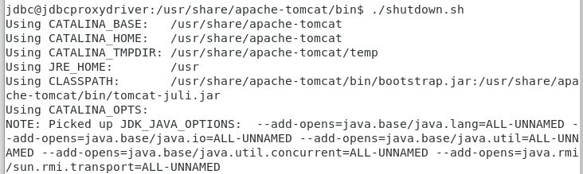
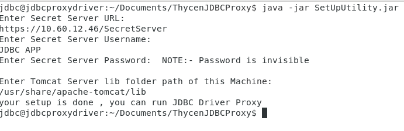
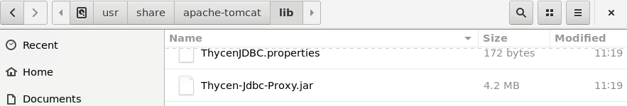
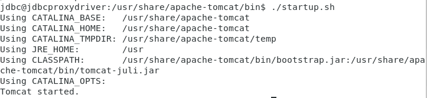

[title]: # (Locate your Database configuration file)
[tags]: # (database, linux)
[priority]: # (106)
# Locate your Database configuration file (Linux)

1. __Stop__ the tomcat service from the terminal.  

   
1. Unzip the __ThyceJDBCProxy.zip__ file and you will get the following jar files in that folder:

   * __SetupUtility.jar__
   * __Thycen-Jdbc-Proxy.jar__
   * __Run SetupUtility.jar__

   >**Note:** The SetupUtility.jar must run on the system where you have the java application is deployed.

1. Run the terminal.
1. Go to to the `ThycenJDBCProxy directory`.
1. Run the following command: `Java -jar SetupUtility.jar`.
1. Enter the __Secret Server URL__, __Secret Server Username__, __Password of the Secret Server__, and __Lib path__ of the apache tomcat server. Please see the following screenshot:  

   
1. Run the SetupUtility to encrypt the Secret Server credentials and create the __ThycenJDBC.properties__ in the current folder.
1. copy the __Thycen-Jdbc-Proxy.jar__ and __ThycenJDBC.properties__ into tomcat server __lib__ folder located at `/usr/share/apache-tomact/lib`.  

   
1. __Start__ the tomcat from terminal.  

   
1. Run your java application and verify the database connection.

   >**Note:** Please check the tomcat server log to confirm whether your application is
using the ThycenJDBC driver proxy or not. If it is using the proxy driver in such
case it will display the following line in the logs:

   * “Using Thycen JDBC Driver”
   * “Trying to connect with secret server”
   * “Secrete fetched successfully”
