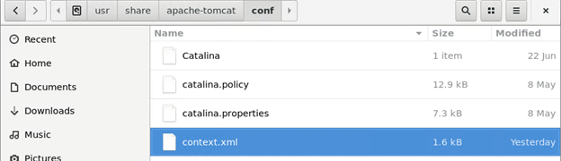
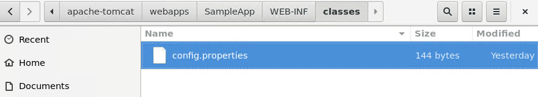
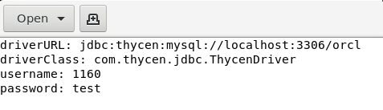

[title]: # (Linux: Locate your DB Config)
[tags]: # (database, linux)
[priority]: # (400)
# Locate your Database Configuration File (Unix/Linux)

There are different ways to connect to the database with the java application, JDBC Proxy Driver Supports following approaches. Identify how your application connects with the database and follow the instructions from the approaches below.

Click here to download the [JDBC Driver Proxy](https://thycoticdownloadsprod.blob.core.windows.net/ssintegrations/JDBCProxyDriver/JDBC.zip?sp=rac[…]zWUH9YC0jwYR0Nj6%2fXjJ7fxsqO7UQA%2BR6RPFkON8%3D)

## Database Lookup Approach

Navigate to your __Apache Tomcat__ folder and edit the __Conf__ file.

### Example: 
   `usr/share/apache-tomact/conf/context.xml`

   

   The following is the database connection string and it should be present in the __context.xml__ file:

   

   ```
   \<Resource __driverClassName__="com.thycen.jdbc.ThycenDriver" auth="Container"
   name="jdbc/orcl"__password__="XXX"
   type="javax.sql.DataSource"__url__="jdbc:thycen:mysql://localhost:3306/orcl"__username__="SSID"/\>
   ```

   For example if you are using MySQL Database your default driver class name should be:

   * __driverClassName:__ com.mysql.jdbc.Driver
   * __url:__ jdbc:mysql://localhost:3306/DBName

   >**Note:** You only have to update the following parameters below:

   * __Username__ : Put the __Secret ID__ (1160) of the secret server
   * __Password__: Put any password
   * __driverClassName__: com.thycen.jdbc.ThycenDriver
   * __url:__ jdbc:thycen:mysql://localhost:3306/DBName

   >**Note:** If you are using a database other than mysql, use the similar prefixes for the
   __“:thycen__” on Driver URL and in Driver Class Name must be __com.thycen.jdbc.ThycenDriver__.
  
## Driver Manager Approach
  
Navigate to your java hosted app and edit the properties file.  
  
### Example

   For this example the properties file resides in the `WEB-INF\Classes` folder and it’s name is __config.properties__. In your case it may vary. Please identify the database config file and change it as per the instructions as follows.

   
   

   * __username__ : Put the __Secret ID__ (1160) of the secret server
   * __password__: Put any password
   * __driverURL__: __com.thycen.jdbc.ThycenDriver__
   * __driverClass:-__ Prefix your __url__ with __“:Thycen__”

   Example: __jdbc:thycen:mysql://localhost:3306/orcl__
