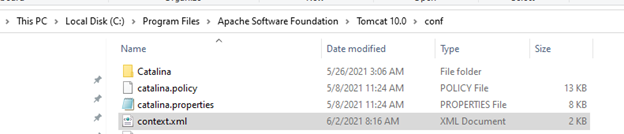
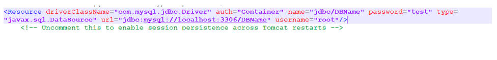
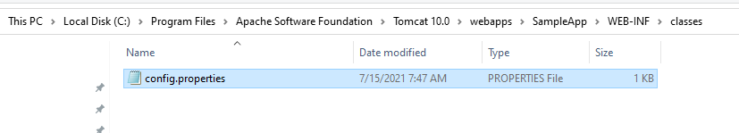
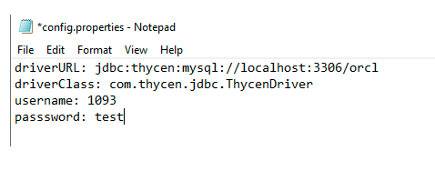

[title]: # (Locate your DB Config (Win))
[tags]: # (database, windows)
[priority]: # (300)
# Locate your Database Configuration File (Windows)

There are different ways to connect to the database with the java application, JDBC Proxy Driver Supports following approaches. Identify how your application connects with the database and follow the instructions from the approaches below.

## Database Lookup Approach

Navigate to your __Apache Tomcat__ folder and edit the __Conf__ file.

### Example

`C:\Program Files\Apache Software Foundation\Tomcat 10.0\conf\context.xml`

   

The following is the database connection string and it should be present in the __context.xml__ file:

   

~~~ 

<Resource driverClassName="com.thycen.jdbc.ThycenDriver" auth="Container" name= "jdbc/orcl"password="XXX" type="javax.sql.DataSource"url="jdbc:thycen:mysql://localhost:3306/orcl"username="SSID"/>

~~~

### Example 

If you are using MySql Database your default driver class name should look like the example below:

   * __DriverClassName:__ com.mysql.jdbc.Driver

   * __url:__ jdbc:mysql://localhost:3306/DBName

You only need to update the following parameters:

   * __Username__ : Put the __Secret ID__ (1160) of the secret server.

   * __Password__: Put any dummy password.  
  
   * __DriverClassName__: com.__thycen.__jdbc.ThycenDriver

   * __url:__ jdbc:thycen:mysql:/localhost:3306/DBName  
  
   * __Change the driver class name to:__ com.thycen.jdbc.ThycenDriver
  
If you are using a database other than the mysql, use the following prefix for:

   * __Driver URL:__ thycen
   * __Driver Class Name:__ com.thycen.jdbc.ThycenDriver.

## Driver Manager Approach
  
Navigate to your java hosted app and edit the following properties file.  
  
### Example

The example below shows that the __properties file__ resides in the `WEB-INF\Classes` folder and it’s name is `config.properties`.

   >**Note:** In your case it may vary. Please identify the database config file and change it as per the instructions below:

   
   

   * __username__ : Put the __Secret ID__ (1160) of the secret server.
   * __password__: Put any password.  
   * __driverURL__: `com.thycen.jdbc.ThycenDriver`
   * __driverClass:-__ Prefix your __url__ with __“:thycen__”. For
example: `jdbc:thycen:mysql://localhost:3306/orcl`.
