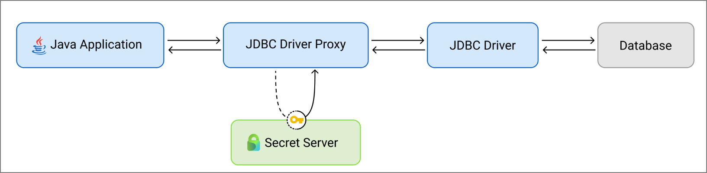

[title]: # (JDBC Driver Proxy)
[tags]: # (introduction)
[priority]: # (1)
# JDBC Driver Proxy

## Introduction

The JDBC Proxy Driver is an additional component that securely and automatically manages database server credentials that are stored inside the java web application configuration file. The JDBC Proxy Driver allows you to store your passwords securely in the Secret Server Vault, and perform automatic password replacement with no need to restart the Application Server, thus eliminating downtime.

Click here to download the [JDBC Driver Proxy](https://thycoticdownloadsprod.blob.core.windows.net/ssintegrations/JDBCProxyDriver/JDBC.zip?sp=rac[…]zWUH9YC0jwYR0Nj6%2fXjJ7fxsqO7UQA%2BR6RPFkON8%3D)

## How it Works

The Java application requests the JDBC Driver Proxy to fetch database credentials from Secret Server and connect to the database.

   

## Minimum Support Requirments for the JDBC Proxy Driver

JDBC Proxy driver works with the Java web application which runs on the tomcat server. Following are the minimum supported version:
   * JDK 11
   * Tomcat Server 9 and above
