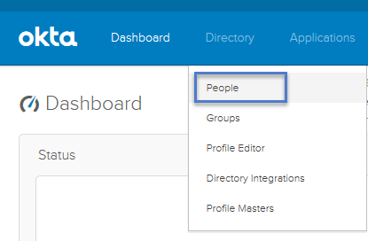
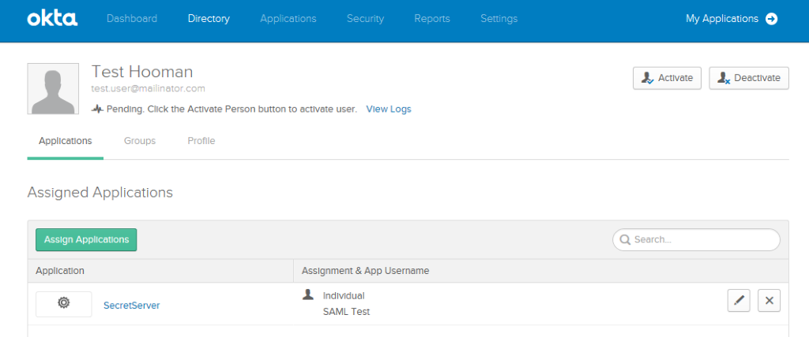

[title]: # (Add Users)
[tags]: # (user config)
[priority]: # (104)
# Add Users to Okta 

1. From Okta's Application Home page (InstanceName/app/UserHome) click __Admin__.
1. Hover over the __Directory__ tab and click __People__.

   
1. Click __Add Person__.
1. Fill out the information as required and once created, click the __username__.
1. Click __Assign Applications__, then click __Assign__ next to the Secret
 Server Service Provider.

   
1. Enter the __Username__ of the corresponding user from Secret Server.

   

   Click __Save and Go Back__ and click __Done__. The Secret Server username should now be listed under Assigned Applications. 

This user should now be able to use the SAML workflow.

Continue with [Verifying the Integration](verify.md).
