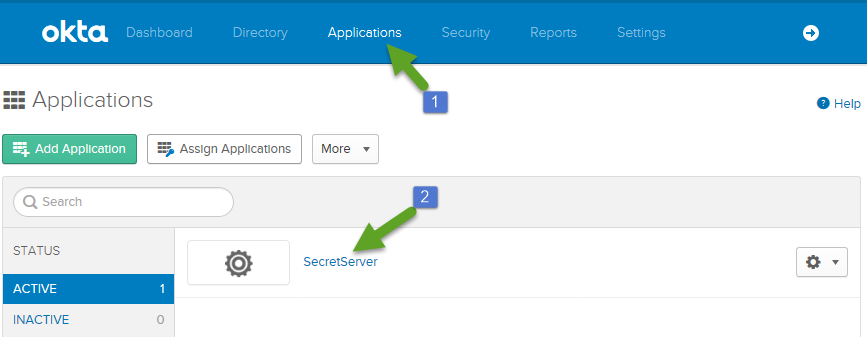
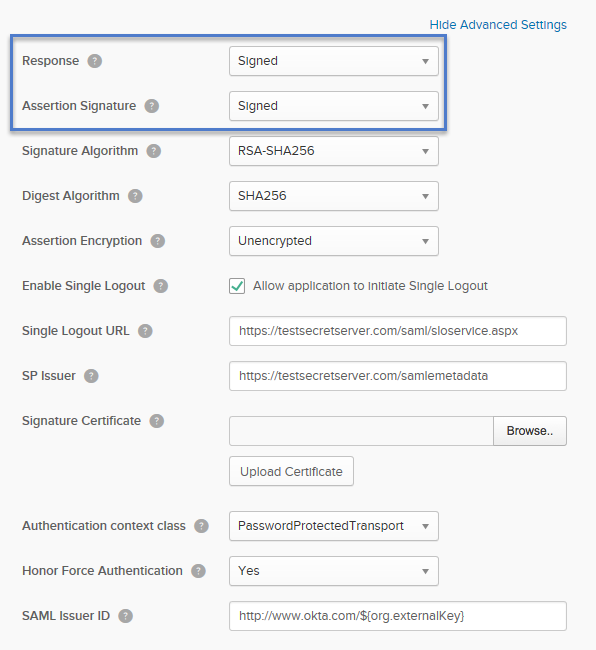
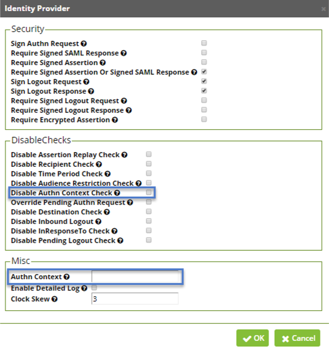
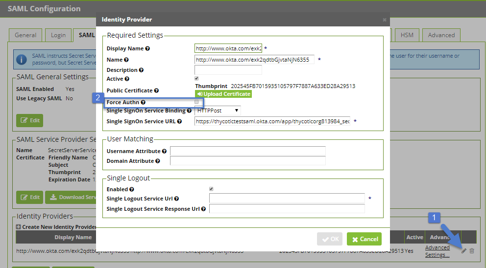
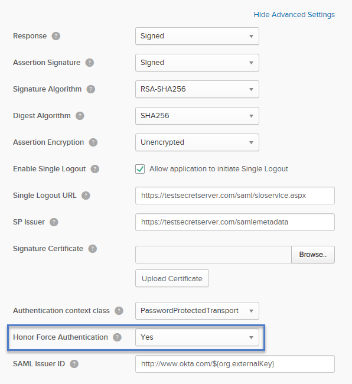

[title]: # (Advanced Settings)
[tags]: # ( )
[priority]: # (106)
# Advanced Settings

The following Secret Server Identity Provider Advanced Settings can be configured in Okta. 

1. From the Okta Admin Dashboard, navigate to __Applications__ then click on your __Secret Server__.
1. Click __Next__.
1. On the Configure SAML page click __Show Advanced Settings__.

   

   >**Note**: These settings correspond to the following Advanced Settings in Secret Server: __Admin | Configuration__ on the __SAML__ tab under __Advanced Settings__ next to your OKTA Identity Provider. 

   

Below are screenshots for the corresponding settings between Secret Server and OKTA. 

##  SAML Response 

Require Signed SAML Response

##  Require Encrypted Assertion

Require Signed Assertion

##  Authn Context / Disable Authn Context Check

##  Force Authn

Require Signed Assertion Or Signed

