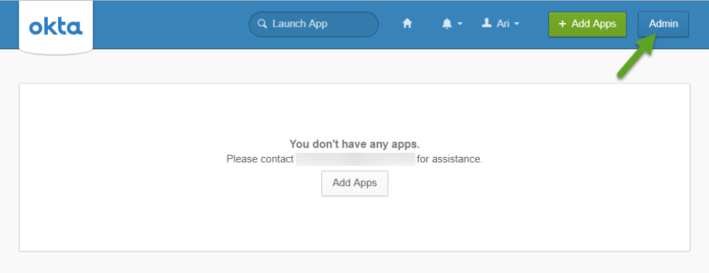
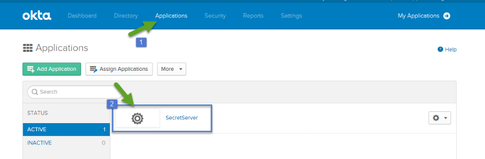

[title]: # (Single Logout)
[tags]: # (introduction)
[priority]: # (103)
# Configure Single Logout

>**NOTE**: Due to browser issues, use the Firefox or Internet Explorer (IE) browsers to complete this section. Do *NOT* use Chrome.

1. Login to Okta and navigate to the __Applications__ homepage, then __Admin__ page.

   
1. Click __Applications__, then __Secret Server Service Provider__.

   
1. Under the __General__ tab, click __Edit__ next to SAML Settings.

   
1. On the General Settings screen, click __Next__. 
1. On the Configure SAML screen, click __Show Advanced Settings__, then check the __Enable Single Logout__ checkbox. 

   1. Single Logout (SLO) Settings:

      *  __Single Logout URL__: your [SecretServerInstanceName] followed by the URL string: `/saml/sloservice.aspx` (e.g. `https://[YourSecretServerInstance.com]/saml/sloservice.aspx`)
      * __SP Issuer__: link to your Secret Server's SAML Metadata, `[InstanceName]/samlemetadata` (e.g. `https://[YourSecretServerInstance.com]/samlmetadata)`
      * __Signature Certificate__: the public key (.cer) file that corresponds to the .pfx uploaded into your Secret Server Service Provider 
        * Click __Browse__ and select your certificate's .cer file
        * Click __Upload Certificate__

   >**NOTE**: The Certificate File Name should change if the upload is successful. If the upload is unsuccessful, ensure you are using the FIREFOX or IE browsers, and not Chrome.

   
1. Click __Next__, then __Finish__.

Continue with [Add Users to Okta](add-users.md).