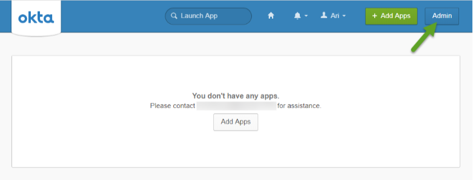
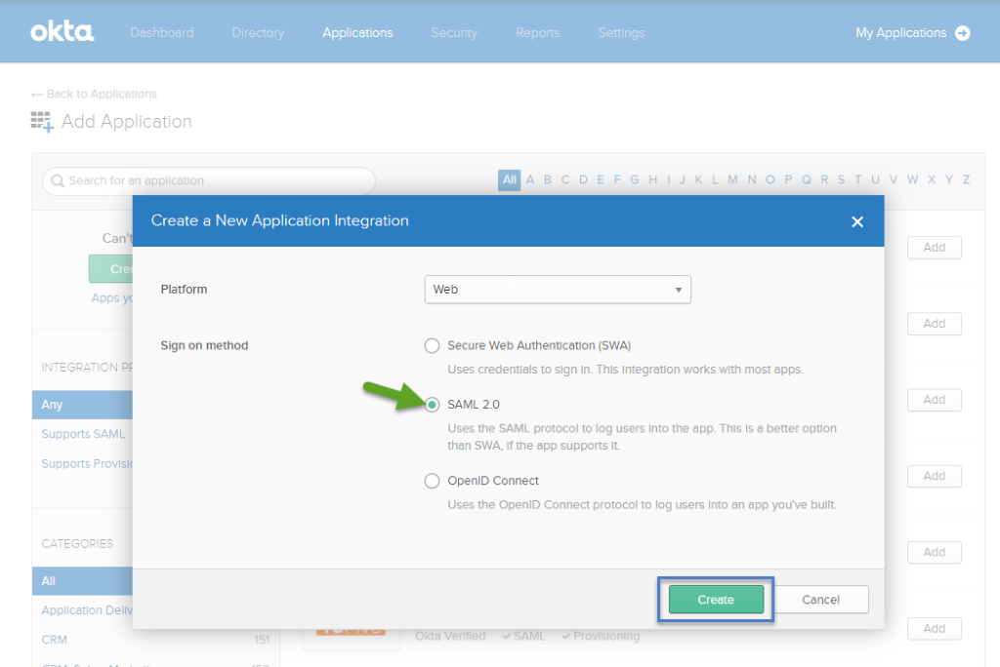

[title]: # (Setup)
[tags]: # (okta admin)
[priority]: # (4)
# Setting up Secret Server as a new App

1. Login to your Okta instance using an administrative account.
1. Navigate to the App Home page ([Instance Name]/app/UserHome), and click __Admin__ | __Applications__ | __Add Application__ | __Create New App__.

   
1. In the __Create a New Application__ pop-up window, select __SAML 2.0__ and click __Create__.

   

1. On the __General Settings__ page, in the __App name__ field, enter the __preferred name__ (e.g. "SecretServer") and click __Next__. (The App name field is the only required input in this screen.)

   

Continue with [Configure SAML](../config/steps/index.md).
