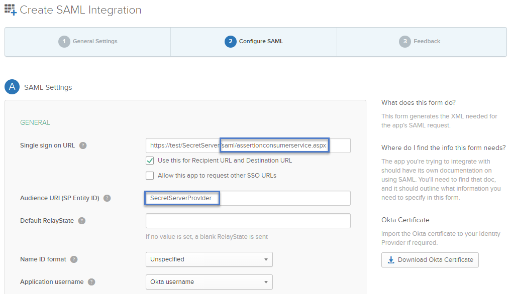
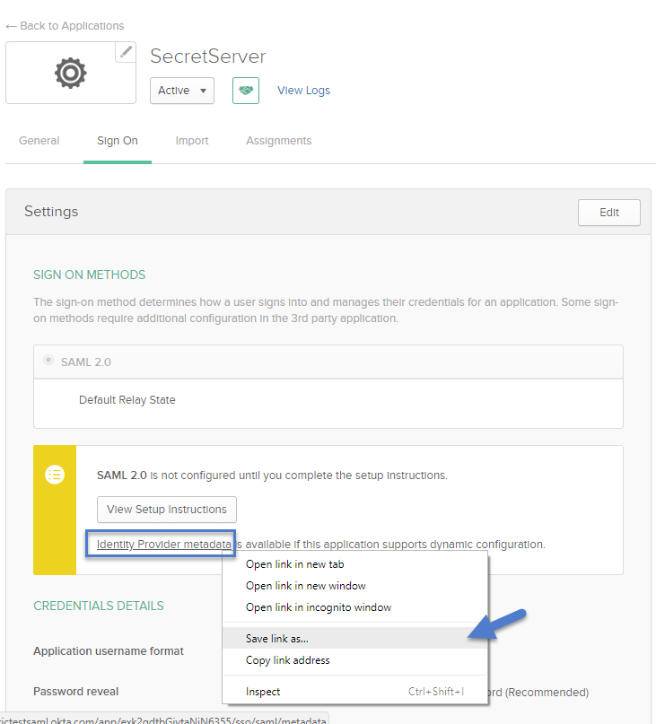

[title]: # (Configure SAML)
[tags]: # (required config)
[priority]: # (101)
# Configure SAML in Okta Application

1. On the __Configure SAML__ screen, enter the __required information__ according to your organizational environment. Required descriptions and examples are:

   

   1. __Single sign on URL__

      * Enter the __URL__ for your Secret Server instance into the following URL:

        `https://[YourSecretServerInstance.com]/samlemetadata`
      * Leave the __Use this for Recipient URL and Destination URL__ checked
      * Leave the __Allow this app to request other SSO URLs__ unchecked if Okta is the only IdP
   1. __Audience URI (SP Entity ID) __

      * Enter the __Service Provider__ configured in Secret Server: e.g. "SecretServerServiceProvider"
      * __Default RelayState__ can be left blank
      * __Name ID format__ can be left unspecified
      * __Application username__ can remain "Okta username”
   1. Click __Next__.
1. On the Feedback screen, select__ I'm an Okta customer adding an internal app__.
1. On the Settings' screen, right-click __Identity Provider metadata__ and click __Save Link As...__ to save the metadata and import into Secret Server.

   

Continue with [Configure SAML in Secret Server](secret-server.md)