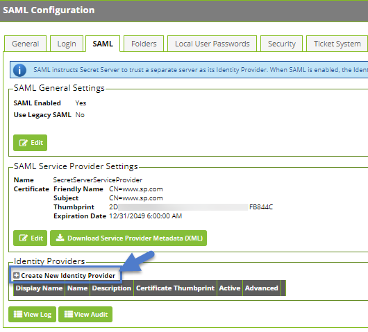
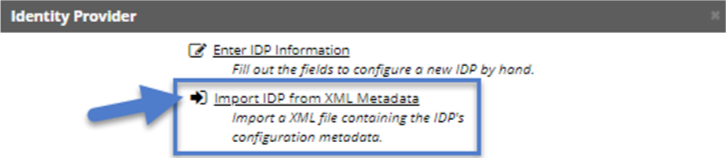

[title]: # (Secret Server)
[tags]: # (introduction)
[priority]: # (102)
# Configure SAML in Secret Server

1. In your Secret Server Instance, navigate to the SAML configuration page __Admin | Configuration__ and select the __SAML__ tab. 
1. Click __Create New Identity Provider__.

   

1. Click __Import IDP from XML Metadata__ and select the __Okta metadata__ previously saved. (If you do not see the file, you may need to change the metadata filetype to .xml.)

   

Continue with [Configure Single Logout](single-logout.md).