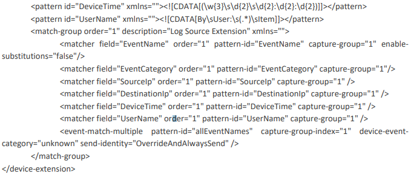

[title]: # (Custom Parsers)
[tags]: # (introduction)
[priority]: # (103)
[display]: # (none)
# Custom Parsers

<!-- add and overview of covered troubleshooting topics 

This section might not be needed depending on scope/complexity of integration.-->

1. Begin by opening the __LSX_Template (Custom Parser)__ file in your chosen text editor.
1. Now analyse the raw data that you are receiving from TSS.
1. Delete all fields from the LSX template that are not included inside TSS, e.g. pre and postnat
addresses.
1. Now you only have left, the fields which are included in TSS you can begin inputting the regex.

   `<pattern id="EventName"xmlns=""><![CDATA[##########]]></pattern>`

   Input the regular expression that matches field you want it to match into the brackets where the
   #’s can be seen.

1. Once you have finished adding in the regex for all of the fields you are done.

## Example Raw Payload

`Aug 18 14:28:06 sv-thyss CEF:0|Thycotic Software|Secret Server|8.6.000010|18|USER -
LOGINFAILURE|2|msg=[SecretServer] Event: [User] Action: [Login Failure] By User: domain.local\\John Snow
Item Name: domain.local\\John Snow suid=6 suser=domain.local\\John Snow duser=domain.local\\John Snow
duid=6 fname=domain.local\\John Snow fileType=User fileId=6 src=192.168.2.27 rt=Aug 18 2014 14:28:03`

As you can see after the 18(Event ID) it states USER – LOGINFAILURE which is the event name. This is
also what we will use to anchor the payload to QRadar. We can also easily map the time, username and
Source IP.

## Example Custom Parser

