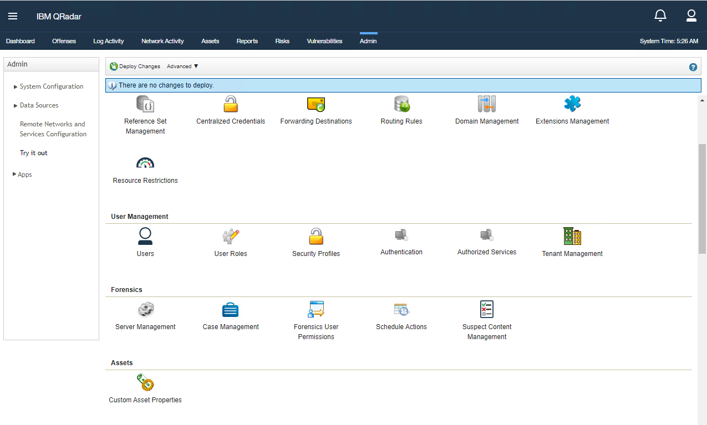
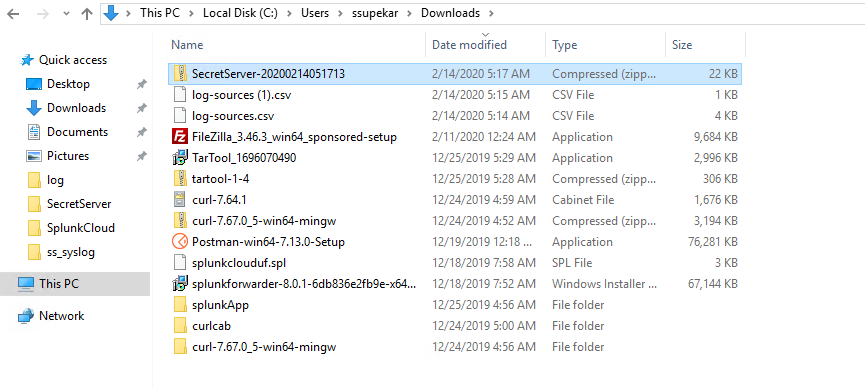
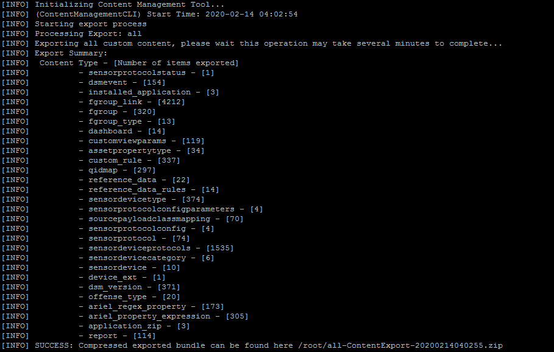

[title]: # (How to Export Event Mappings)
[tags]: # (introduction)
[priority]: # (105)
# How to export the event mappings along with the Custom DSM

**After Creating your QIDmap entries, you can map them to your events using the
DSM editor and export them via the export option.**

1. Navigate Login to Qradar and click on Admin  

    
1. Click on DSM editor option and select created log source i.e SecretServer in our case**  

    
1. Click on Select.

1. Then click on Export option**  

    
1. Enter the details and click on Export button.

    
1. Zip will be downloaded.

    

   __You create a custom DSM, and map new events to it using the DSM Editor, lets call it "SecretServer"__.

## To search for your DSM using the ContentManagement Tool

Enter in the following command:

   `[root\@qradar \~]\# /opt/qradar/bin/contentManagement.pl --action
search --content-type 24 --id all --regex "\\w" \|grep Secret`   

   

## To export everything and the custom mappings related

Enter in the following command:

   `[root\@qradar \~]\# /opt/qradar/bin/contentManagement.pl -a export -c all`

   `/opt/qradar/bin/contentManagement.pl -a export -c sensordevicetype -i 4001`

## Result

   

   

1. Rename your zip file MyExport.zip

1. On the new Qradar fresh install, just copy the .zip file and reimport it

Enter in the following command:

   `[root\@qradar \~]\# /opt/qradar/bin/contentManagement.pl --action import --file MyExport.zip`