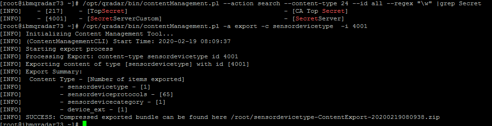
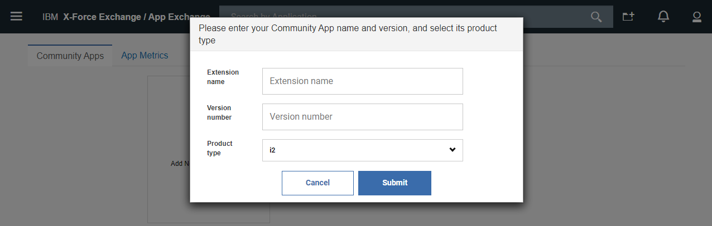
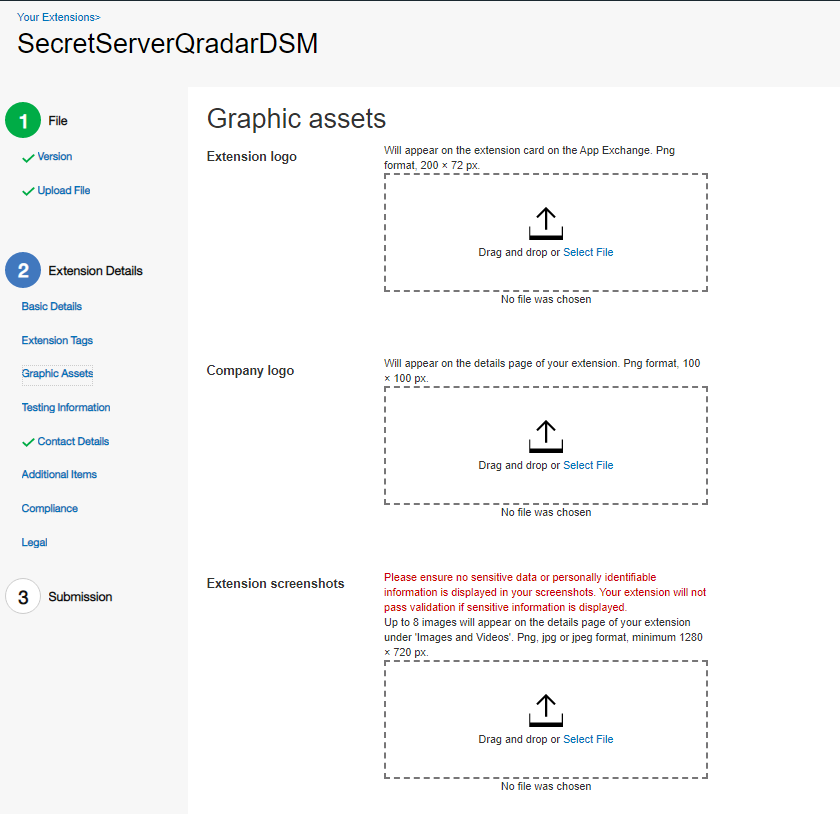

[title]: # (How to Publish to IBM App Exchange)
[tags]: # (introduction)
[priority]: # (106)
# How to Publish to IBM App Exchange

There are four key steps to get your zip ready for submission using the App Submission portal. All extensions published to the IBM Security App Exchange must include a manifest.txt and must be signed by your IBM issued certificate.

Your extension will not pass validation unless these have been included.  

## Requirements

1. Export your content from your QRadar system
1. Add a customized manifest.txt to the extension
1. Generate and submit a Certificate Signing Request (CSR)
1. Sign your extension
1. Subsequent extension submissions and updated versions

## Step 1: Exporting your extension or content from Qradar

1. To search for your DSM using the ContentManagement Tool

   Enter in the following command:

   `[root\@qradar \~]\# /opt/qradar/bin/contentManagement.pl --action search --content-type 24 --id all --regex "\\w" \|grep Secret`

   

1. To export everything and the custom mappings related

   Enter in the following command:

   `[root\@qradar \~]\# /opt/qradar/bin/contentManagement.pl -a export -c all`

   `/opt/qradar/bin/contentManagement.pl -a export -c sensordevicetype -i 4001`

## Results

   

## Adding a manifest to an extension

   Login to App exchange and Click the “Submission Portal” link in the left menu bar, and follow the submission process. (refer below image)

   

## Steps for Submission

1. Click on Add new app.

   

1. Enter the details to Add Your New Extension:

   

1. Press Submit.
1. Complete the Extension Details Screen.
 
   

   

1. Provide Your Graphic Assets (Screen shots, Company Logo, Video).

   

1. Supply Testing Information for our Validation Engineers.

   

1. Provide Contact Information.

   

   Preview Your Submission Make sure all information is provided. Submit Your Solution for Validation.

   
