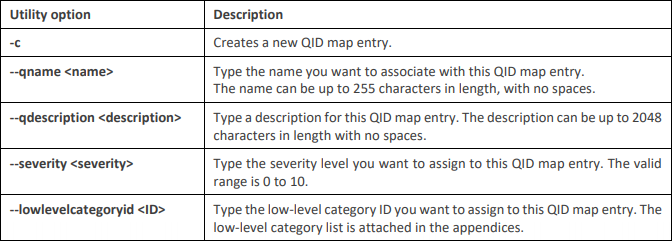
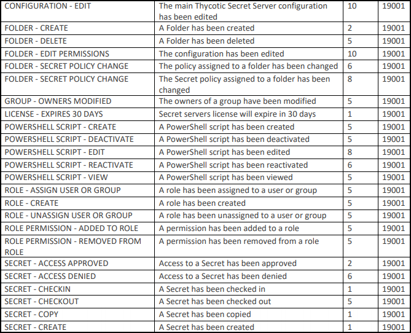

[title]: # (QID Mappings)
[tags]: # (introduction)
[priority]: # (104)
# QID Mappings

The QID or QRadar Identifier is what QRadar uses to give events their name, high-level category and lowlevel category.

1. We now need to create custom QIDs. Do this by SSH-ing into the QRadar console, changing the directory to __/opt/QRadar/bin__ and running the following command:

   `./qidmap_cli.sh -c --qname <name> --qdescription <description> --severity <severity> --lowlevelcategoryid <ID>`

   For Example:

   `./qidmap_cli.sh -c --qname “USER – LOGIN” --qdescription “A user as logged in.” --severity 1 –lowlevelcategoryid 19001`

   
1. Alternatively you could use a csv list as demonstrated in the in the __Import List__ section and use it with the following command to import several QIDs at once:

   `/opt/QRadar/bin/qidmap_cli.sh -i -f <filename.txt>`

   19001 is used for most of the low-level category IDs as an example.

1. Using the program __sendnow__, send the list of all events to your QRadar box in the .txt file you named (example: __tss events all.txt__) to generate every possible event. The events can be found in the Event List section below.

## Event List
   
   
   