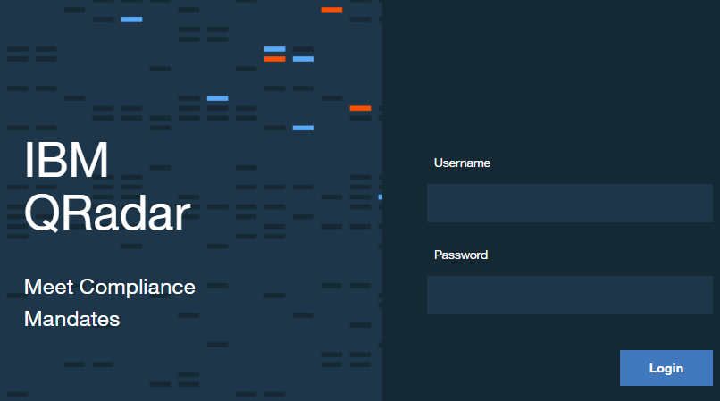
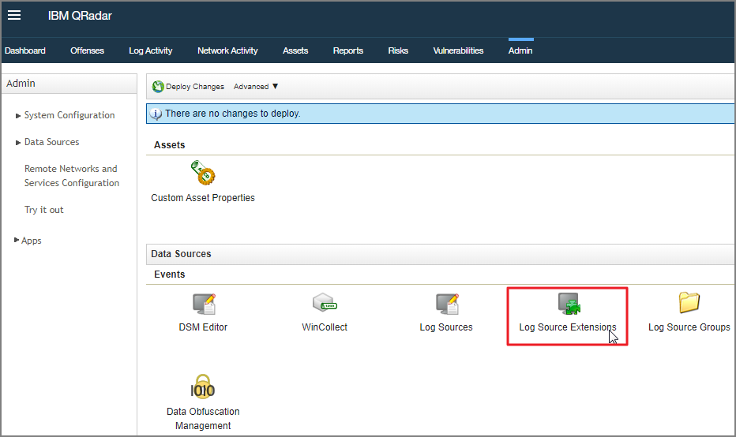
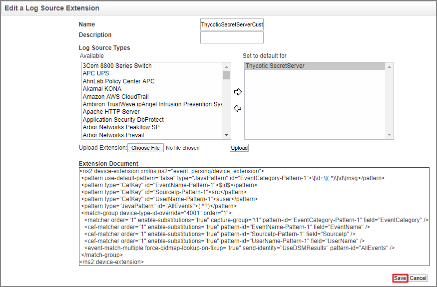

[title]: # (Upload a Custom Parser)
[tags]: # (introduction)
[priority]: # (102)
# Upload a Custom Parser

1. Save the following as an xml file. This is an example of a Custom Parser that you will need to upload in step 8.

   ```xml
   <?xml version="1.0" encoding="UTF-8" standalone="true"?>
   - <ns2:device-extension xmlns:ns2="event_parsing/device_extension">

      <pattern id="EventCategory-Pattern-1" type="JavaPattern" use-default-pattern="false">\|\d+\|(.*)\|\d\|msg</pattern>

      <pattern id="EventName-Pattern-1" type="CefKey">$id$</pattern>

      <pattern id="SourceIp-Pattern-1" type="CefKey">src</pattern>

      <pattern id="UserName-Pattern-1" type="CefKey">suser</pattern>

      <pattern id="AllEvents" type="JavaPattern">(.*?)</pattern>
         - <match-group order="1" device-type-id-override="4001">

         <matcher order="1" field="EventCategory" pattern-id="EventCategory-Pattern-1" capture-group="\1" enable-substitutions="true"/>

         <cef-matcher order="1" field="EventName" pattern-id="EventName-Pattern-1" enable-substitutions="true"/>

         <cef-matcher order="1" field="SourceIp" pattern-id="SourceIp-Pattern-1" enable-substitutions="true"/>

         <cef-matcher order="1" field="UserName" pattern-id="UserName-Pattern-1" enable-substitutions="true"/>

         <event-match-multiple pattern-id="AllEvents" send-identity="UseDSMResults" force-qidmap-lookup-on-fixup="true"/>
      </match-group>
   </ns2:device-extension>
   ```

1. Log into __QRadar__ on your web browser.

   
1. Click the __Admin__ tab.

   
1. Click on __Log Source Extensions__.

   
1. Click on __Add__.

   
1. Add a name and description for the Log Source Extension.
1. Click __Choose File__.

   
1. Select the xml file you created in step 1 with the provided example.
1. Click __Upload__.
1. Select the log source extension and __set it to the default__.

   
1. Click __Save__.

1. Click on __Log Sources__.

   
1. Click __Add__.

   
1. Fill in the required fields:
   * __Log Source Name__
   * __Log Source Description__
   * __Log Source Type__
   * __Protocol Configuration__
   * __Log Source Identifier__
   * __Log Source Extension__: Click the drop-down and choose your custom-built parser (the xml file that was saved as a log source extension).

1. Click __Save__.

   
