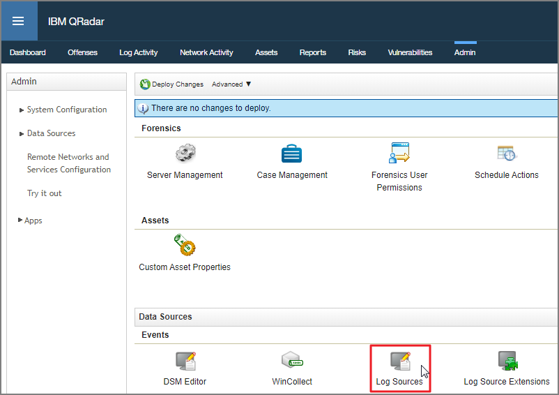

[title]: # (Upload a Custom Parser)
[tags]: # (introduction)
[priority]: # (102)
# Upload a Custom Parser

1. Log into __QRadar__ on your web browser.

   
1. Click the __Admin__ tab.

   
1. Click on __Log Sources__.

   
1. Click __Add__.

   
1. Fill in the required fields:
   * __Log Source Name__
   * __Log Source Description__
   * __Log Source Type__
   * __Protocol Configuration__
   * __Log Source Identifier__
   * __Log Source Extension__: Click the drop-down and choose your custom-built parser.
1. Click __Save__.

   
