[title]: # (Secret Server Dashboard)
[tags]: # (dashboard)
[priority]: # (300)
# Secret Server Dashboard Extention

This section is about the Secret Server Dashboard extension in IBM QRadar.

   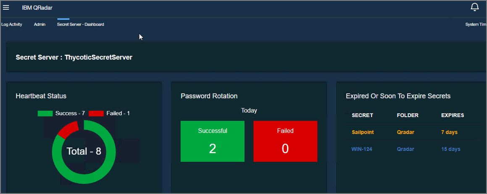

## How to Download the Secret Server Dashboard Extention

1. Navigate to __IBM X-Force Exchange__.
1. Search the for __Secret Server Dashboard Extention__.

   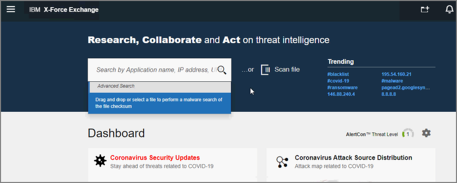
1. Download the extension.
1. Navigate to the __IBM QRadar console__.
1. Click on __Admin__.

   
1. Click on __Extension management__ to manage the extension.

   

## Secret Server settings

1. Navigate to __Secret Server__.
1. Click on __Admin__ | __Remote Password Changing__.

1. Click __Edit__.

   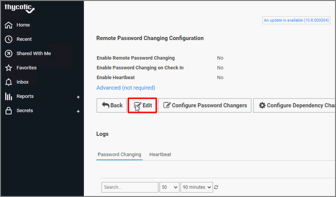
1. Enable __Remote Password Changing__ and __Enable Heartbeat__.
1. Click __Save__.

   
1. Under the __Password Changing__ and __Heartbeat__ tabs, click __Run Now__.

   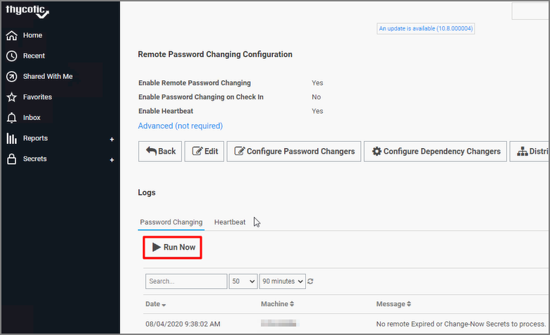
   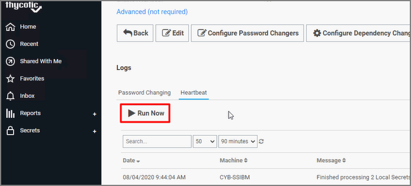

## Create an Authorized Token

1. Navigate to the __IBM QRadar console__.
1. Click on __Admin__.

   
1. Click on __Authorized Services__.

   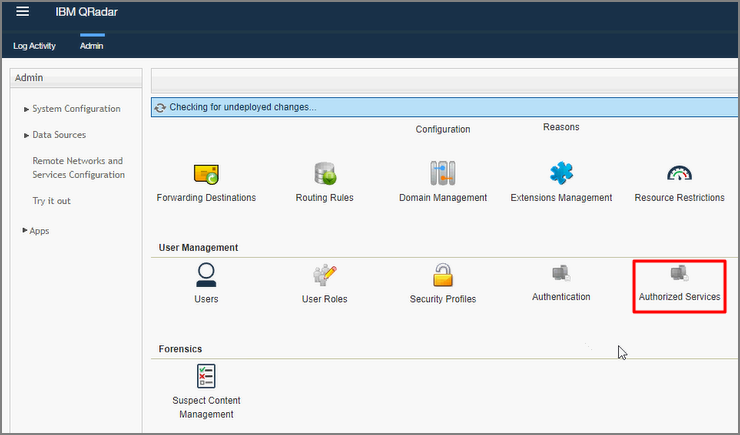
1. Copy the __Authentication Token__.

   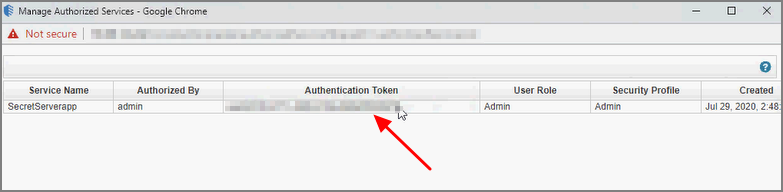
1. Go back to the Admin console and click on __Secret Server__ under Secret Server Dashboard.

   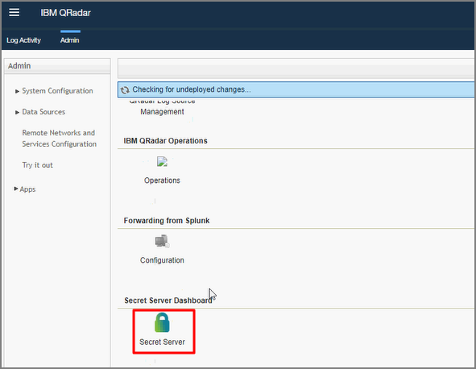
1. Enter the copied Token in __SEC Token__.
1. Select a __Log Source__ (Example: ThycoticSecretServer).
1. Click __Save__.

   
1. Refresh the Admin console window.
1. Click on the __Menu__ option.

   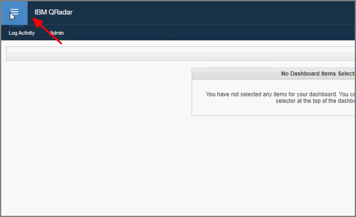
1. Click on __Secret Server - Dashboard__.

   

   >**Note:** To add this to your favorites, click the star.

The Secret Server Dashboard will be displayed.

   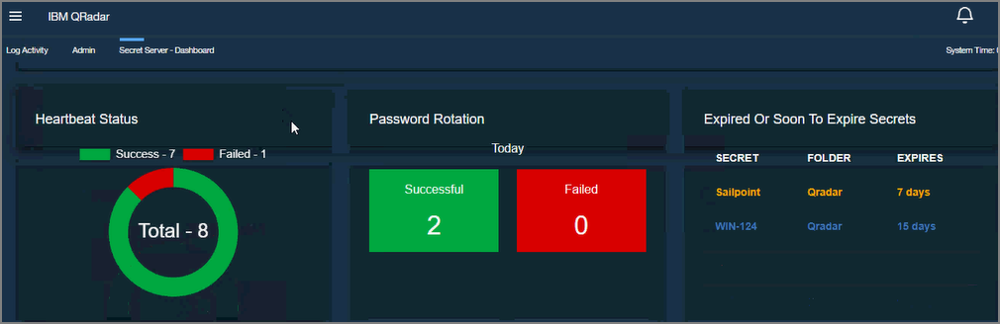

   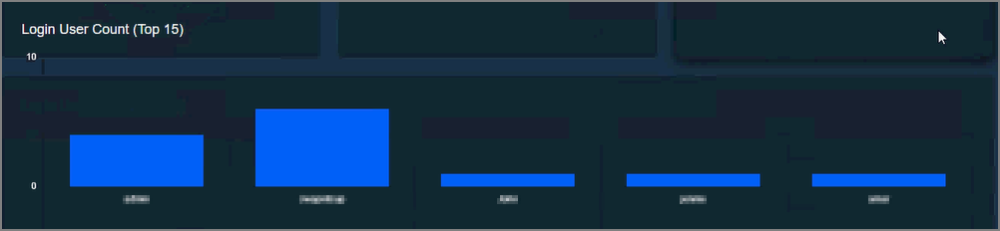

   
