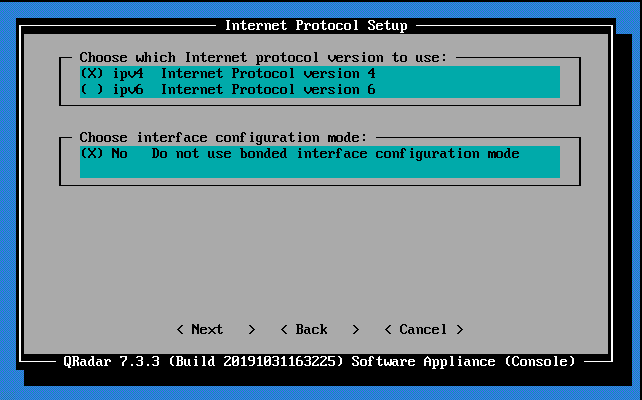
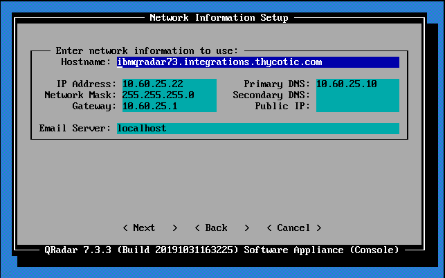
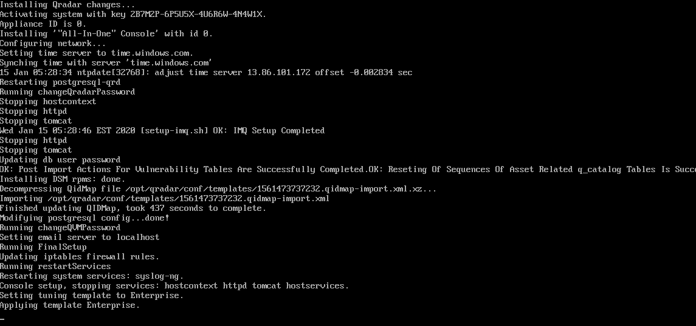
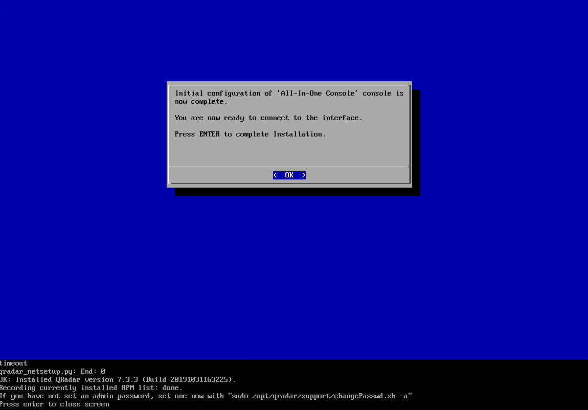
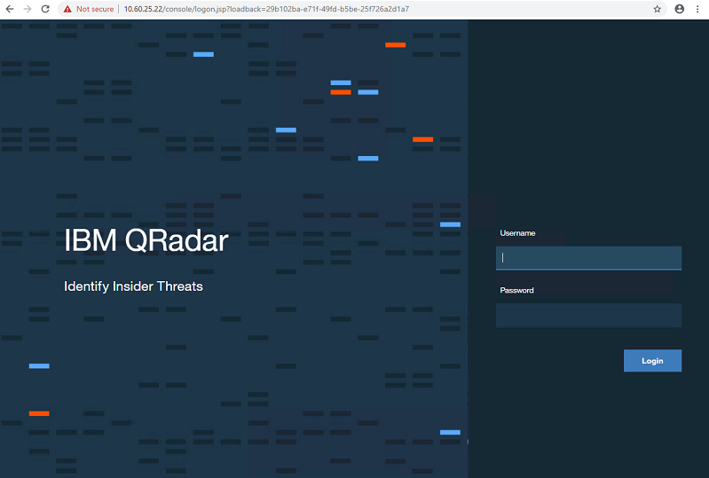
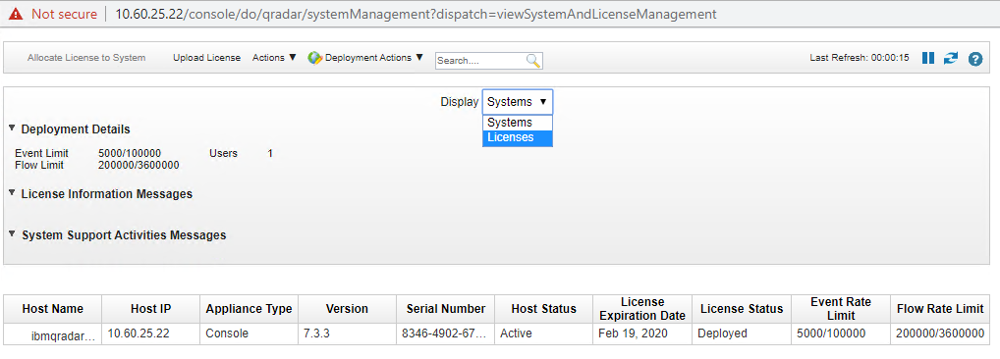

[title]: # (Installing Qradar after the RHEL installation)
[tags]: # (introduction)
[priority]: # (4)
# Installing Qradar after the RHEL installation

1. Copy the QRadar ISO to the device.  

   

1. Create the /images/cdrom directory by typing the following command:  

   `mkdir /images/cdrom`

1. Mount the QRadar ISO by using the following command:

   `mount -o loop \<nameofiso.iso\> /images/cdrom`

1. Run the QRadar setup by using the following command:  

   `/images/cdrom/setup`
­­
   

   

   >**Note:** A new kernel may be installed as part of the installation, which requires a system restart.  

   

   __Repeat the commands in steps 3 and 4 after the system restart to continue the installation__.

1. Select the appliance type:

   * Software Install
   * High Availability Appliance

1. Select the appliance assignment, and then select next.  

   

1. If you selected an appliance for high-availability (HA), select whether the appliance is a console.

1. For the type of setup, select Normal Setup (default) or HA Recovery Setup, and set up the time.  

   

1. If you selected HA Recovery Setup, enter the cluster virtual IP address.
1. Select the Internet Protocol version: • Select ipv4 or ipv6.  

   

   

1. If you selected ipv6, select manual or auto for the Configuration type.

1. Select the bonded interface setup, if required.

1. Select the management interface.

1. In the wizard, enter a fully qualified domain name in the Hostname field.

1. In the IP address field, enter a static IP address, or use the assigned IP
address.

1. If you do not have an email server, enter localhost in the Email server name
field.

1. Leave the root password as it is.

1. If you are installing a Console, enter an admin password:  

   

1. Click Finish.  
1. Follow the instructions in the installation wizard to complete the installation. The installation process might take several minutes.  

   

   

1. If you are installing a Console, apply your license key.

   a) Log in to QRadar as the admin user,
   https://\<IP_Address_Qradar\>  

   

   b) Click **Login**.

   c) On the navigation menu ( ), click **Admin**.

   d) In the navigation pane, click **System Configuration.**

   e) Click the **System and License Management** icon.  

   

   f) From the **Display** list box, select **Licenses**, and upload your license key.  

   

   g) Select the unallocated license and click **Allocate System to License**.

   h) From the list of systems, select a system, and **click Allocate System to License**.  

   