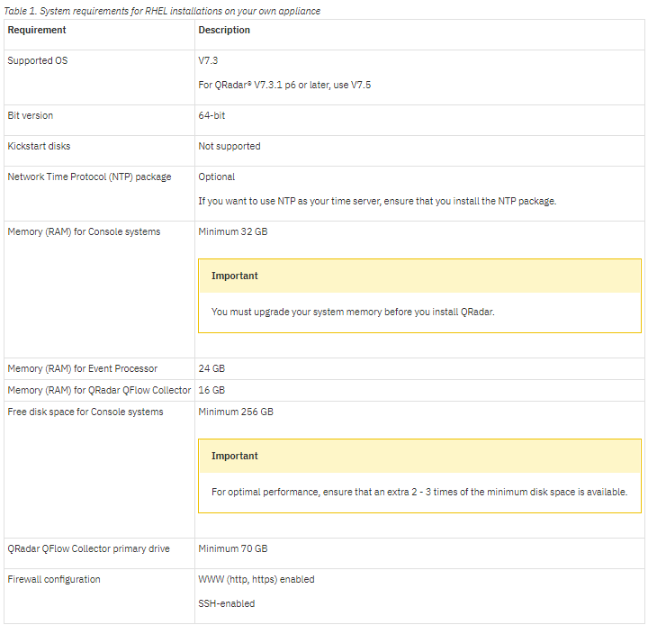

[title]: # (Requirements)
[tags]: # (introduction)
[priority]: # (2)
# Prerequisites for installing QRadar on your hardware

Before you install the Red Hat Enterprise Linux (RHEL) operating system on your hardware ensure that your system meets the system requirements.

The following table describes the system requirements:

   
