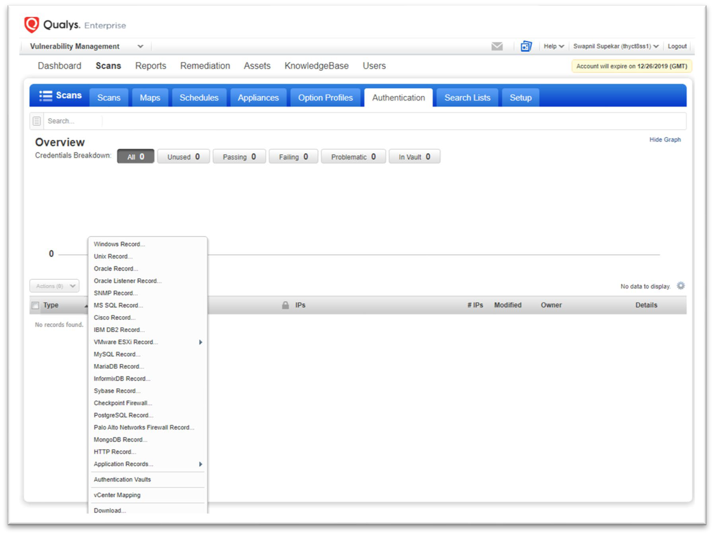
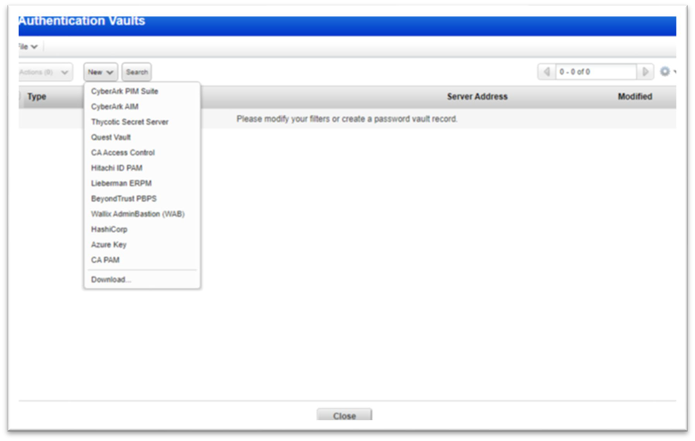
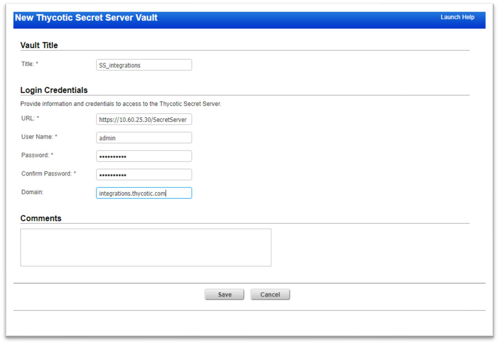
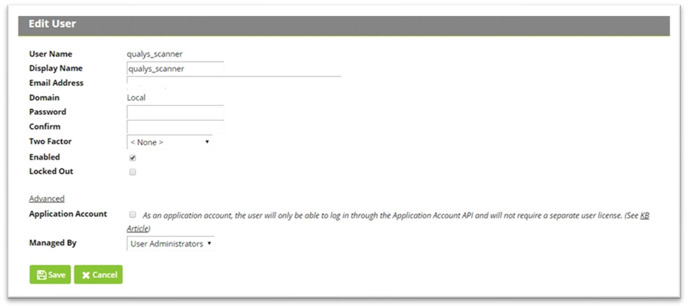

[title]: # (Configure the Vault)
[tags]: # (vault)
[priority]: # (101)
# Configure the Vault

To use Secret Server, an administrator must configure it as a Vault within Qualys by specifying a URL and credentials to access the on-premises Secret Server instance.
   
Instead of adding username/password credentials for use in trusted scans, the administrator can point to named records stored in Secret Server. Qualys will retrieve the credentials from Secret Server at scan time for trusted scans.

## Add New Authentication Vault in Qualys

1. Navigate to the Scan and click the __Authentication__ tab.

   
1. Select __Authentication Vaults__ from the new drop-down list.

   
1. Select __Thycotic Secret Server__ from the list.

1. Enter the following __access information__ for your Secret Server site:

   * __URL__: This is the URL for Secret Server web services. Ensure web services are enabled in your Secret Server instance by clicking __Configuration__ from the Administration menu and enabling web services.

   * Add /sswebservices/sswebservice.asmx to your Secret Server URL to obtain the URL for the web services:
   >   [https://yoursecretserver/sswebservices/sswebservice.asmx.](https://yoursecretserver/sswebservices/sswebservice.asmx)

   

   >**Note**: If you do not have SSL enabled, web services can still be accessed via http but it is not advisable for production systems. The vault is accessed from the scan agent, so the Secret Server website must be reachable from the Qualys scanner appliance – not the Qualys cloud instance.

   * __User Name__: The user account for accessing Secret Server. This can either
    be a local Secret Server account or an Active Directory account. User
    accounts can be created in Secret Server from the Users section of the
    Administration menu. This user account should be an application account.

1. Click __Advanced__, click the checkbox of __Application Account__.
1. Click __Save__.

   
