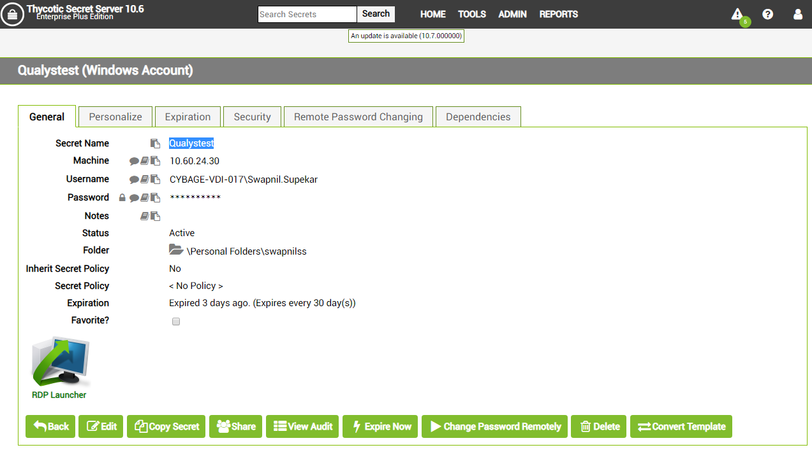
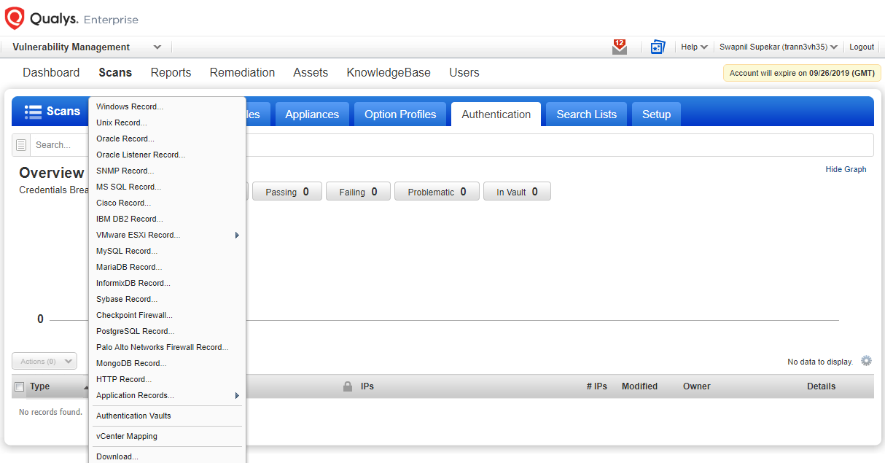
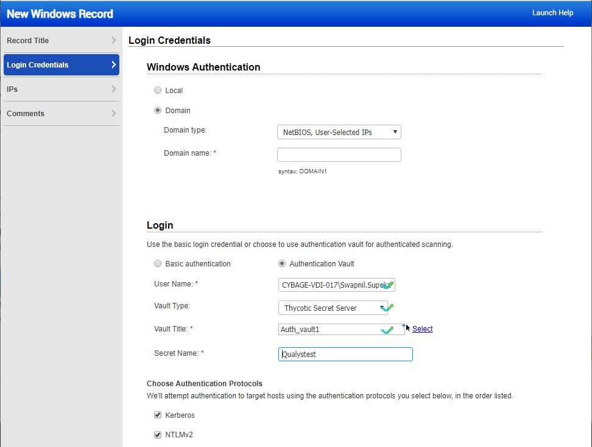

[title]: # (Creating Authentication Records)
[tags]: # (authentication)
[priority]: # (102)
# CREATING AUTHENTICATION RECORDS**

Once the authentication vault has been configured, individual authentication
credentials can be configured to retrieve their passwords from Secret Server. To
create an Authentication Record (Windows, Unix, Oracle, Oracle Listener, MS SQL
Server, and IBM DB2 authentication vault integration is supported by Qualys
today), select the record type from the New menu in the Authentication tab.

The Authentication Vault configuration requires three additional details to
retrieve the password:

**Vault Type** This should be set to Thycotic Secret Server

**Vault Title** This is the name of the previously created Authentication Vault
record in Qualys.

**Secret Name** This is the Secret record in Secret Server that contains the
accounts password. (see below figure).In this case, Secret Name for the Windows
Account is Qualystest.

The Secret Name must match exactly the corresponding Secret Name in Secret
Server (see Figure 4).

Figure 4: Windows Authentication Vault Record

**Note** Ensure that the Secret Name exactly matches the name specified in
Qualys. In addition to creating a Secret with the correct password for the
credential used for authenticated scanning, the Qualys user account must be
granted at least View access to the Secret. Click **Share** to view the
permissions on the Secret.

In this case the Secret inherits permissions from the folder settings, which is
generally a best practice. View the folder level permissions by editing the
folder the Secret is in.

Once the Secret is configured with the proper permission, Qualys can use it in
scans. Run a scan that uses that authentication record to verify that everything
is working end-to-end.