[title]: # (Scan for Vulnerabilities)
[tags]: # (scan, vulnerabilities)
[priority]: # (103)
# Scan for Vulnerabilities

Scan your systems for known vulnerabilities and understand your security risk.
By automating your scans you'll get up to date security intelligence in real
time.

__Let’s launch a vulnerability scan__

1. Go to __Scans | Scans | New | Scan (or Schedule Scan)__.

1. The following window below will open.
1. Check for the Scanner appliance, if the Scanner
appliance shown in the image below is not available then you will need to first setup Scanner appliance.

   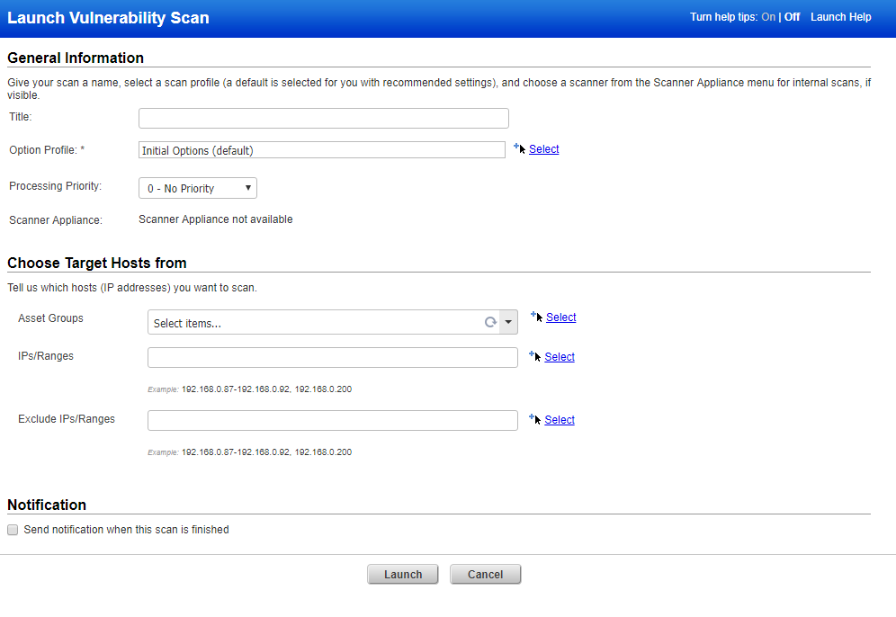

__Setting up Scanner appliance__

Qualys Scanner Appliance, an option with the Qualys Cloud Platform from Qualys, Inc. With the Qualys Scanner Appliance, you can assess internal network devices,
systems and web applications. The Scanner Appliance is a robust, scalable solution for scanning networks of all sizes including large distributed networks.

__Use Scanner Appliances__

You could configure physical scanner appliance, virtual scanner appliances to
assess internal network devices, systems and web applications. 

1. To configure the Scanner appliance navigate to __Scans | Appliance__ and select the option.

   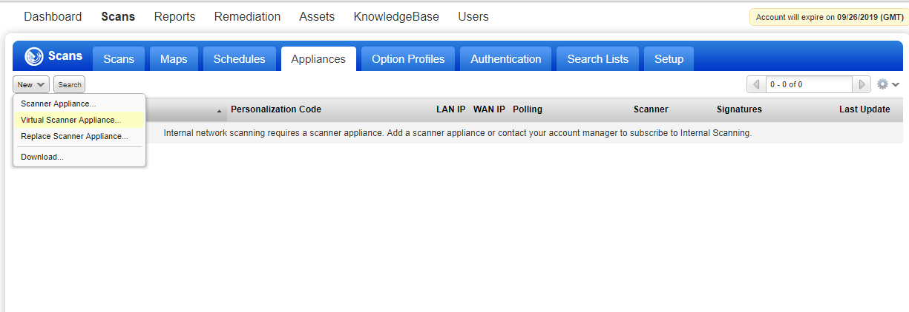

__Qualys Virtual Scanner Appliance__

The Qualys Virtual Scanner Appliance has multiple distributions to support deployments on a variety of virtualization platforms. However, the Qualys Virtual Scanner Appliance is sold as a single product with a single SKU. Each purchased license entitles the user to one *active* Qualys Virtual Scanner Appliance.

The Qualys Virtual Scanner Appliance acts as an extension of the customer's solution subscriptions on the Qualys Cloud Platform and is not a standalone solution. Using the same license, customers are free to delete an instance of the Qualys Virtual Scanner Appliance at any time and redeploy another instance
(of any distribution) in its place or in an entirely different location.

__Configure and activate your scanner__

   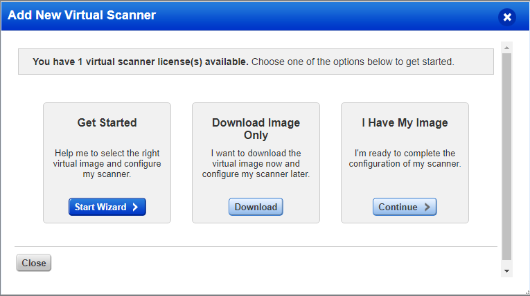

## Add Your Virtual Scanner

1. Start the Wizard.

1. Go to __Scans | Appliances__.
1. Click __New | Virtual Scanner Appliance__.

1. Choose your virtualization platform.

1. Give your scanner a name and select the virtualization platform you would like to use.

   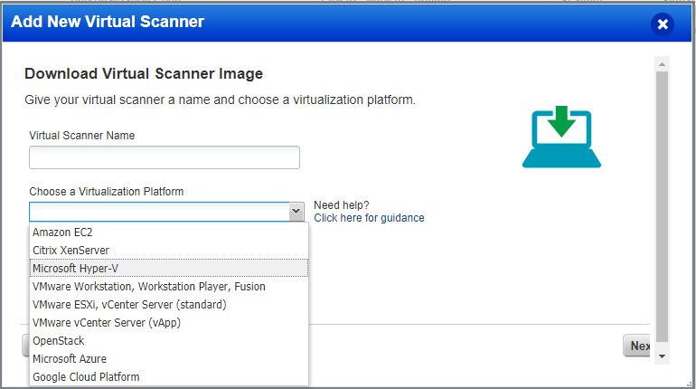

1. Download the Image.

   >**Note:** This step applies to virtualization platforms with a scanner appliance image download (i.e. for VMware, Citrix XenServer, etc). Locate the Virtual Scannerimage on your local system.

   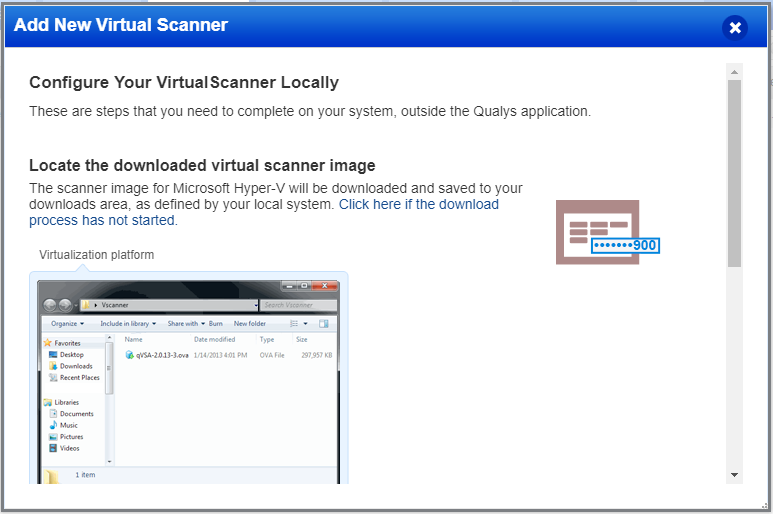

1. Get your Personalization Code.

1. Copy the code to a safe place (you will need the code in a  later step).

   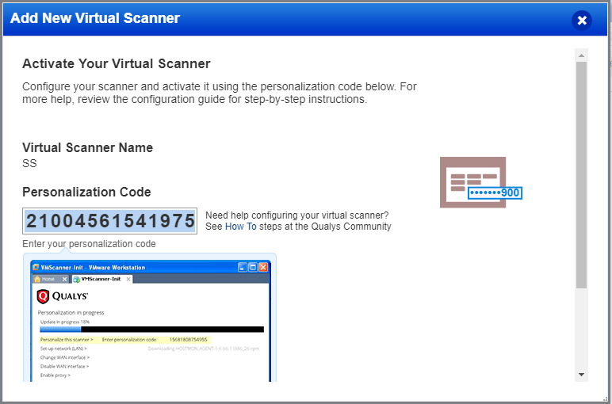

1. Personalize Your Scanner Local system or server.

These steps apply when you have downloaded a scanner appliance image (i.e. for VMware, Citrix XenServer, etc). You will use the Virtual Scanner Console running on your virtualization software to complete these steps.

## Configure a virtual scanner using Microsoft Hyper-V

The following steps can be used to configure a virtual scanner appliance using Microsoft Hyper-V. Once you've successfully configured your scanner it will be ready for scanning.

__Before you begin:__
   * Download the virtual scanner image
(*qVSA-2.0.13-1-vhd.zip* or later).
   * Obtain a personalization code.

1. Start the virtual scanner machine.
1. Unzip the download file (qVSA.i386-2.4.26-11.vhd.zip) to obtain the virtual hard disk file __qVSA.i386-2.4.26-11.vhd.zip__.
1. Log in to the Hyper-V server.
1. Go to __Manager | Hyper-V Manager__.
1. Add a new Virtual Machine.
1. Provide a name for the scanner.
1. Configure the memory (Recommended is 2048 MB or more).
1. Configure the network adapter on the scanner so it can be used as a virtual network for communication.
1. For the virtual hard disk configuration, select __Use an existing virtual hard disk__ and provide the location of the .vhd file (obtained from the download .zip file).
1. Click __Next__.
1. Click __Finish__.
1. Press the Right arrow to select __Personalize this scanner__.

   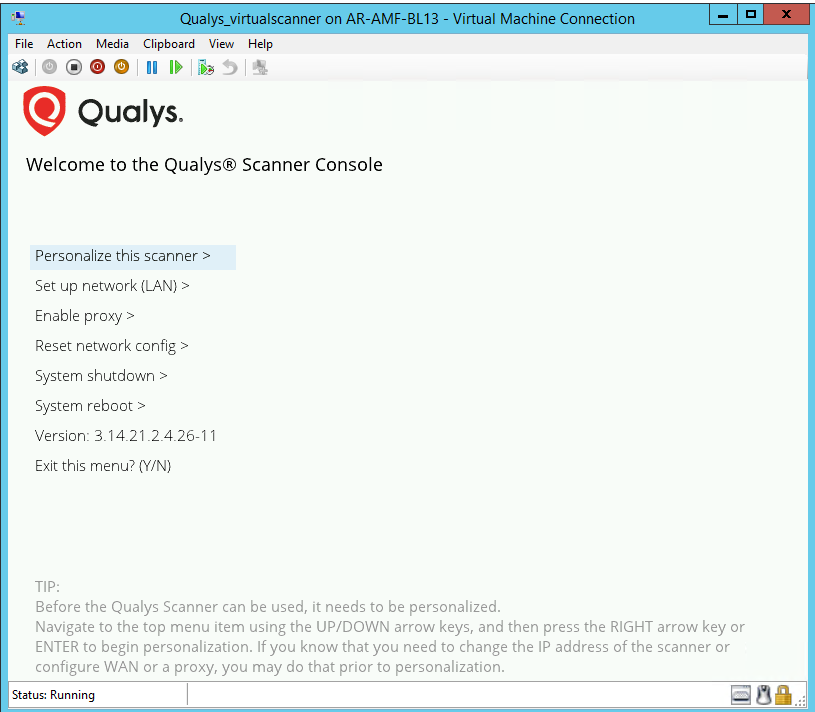

   >**Note:** The virtual scanner will use DHCP without proxy configuration,unless you make custom settings first. For custom configurations, go to __Set up network__ by pressing the Down arrow one time and then the Right arrow one time.

1. Enter your personalization code.

1. One activation code is used to activate one virtual scanner. After entering the code the activation process starts and the service reports the progress.

   >**Note:** Activation may take a few minutes to complete.

   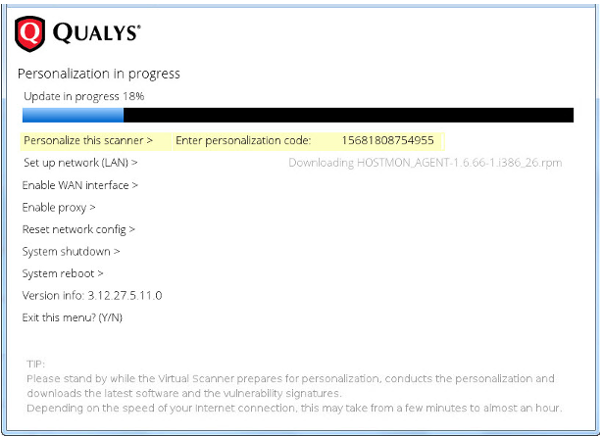

1. Wait until activation completes.

1. The virtual scanner attempts to make a connection to the Qualys Cloud Platform using its current configuration (network and proxy settings). Upon success, the scanner’s friendly name and IP address appear and the scanner is ready to be used for scanning. 

1. Press __Enter__ to go to the main menu.

   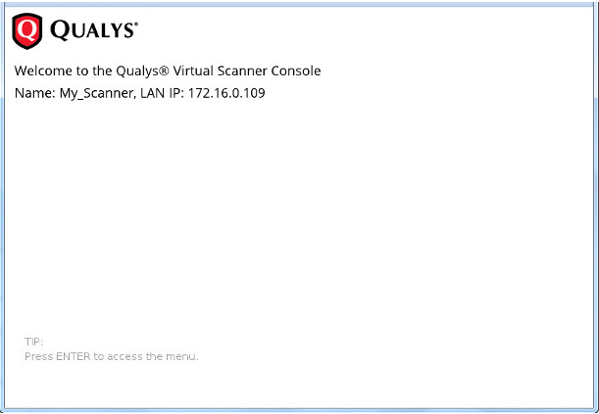

__AUTOMATICALLY CHANGE PASSWORDS AFTER EACH SCAN__

You can leverage Secret Server’s Check Out feature to ensure that passwords used for authenticated scanning are changed after use. This is an important measure in protecting your privileged accounts from __Pass-the-Hash__ attacks, because it
means that the password hash stored in each machine from use during scanning will no longer be valid once the password has been changed in Active Directory. Check Out with Change Password on Check In means that the password for your domain account will be changed automatically after scanning is complete.

   >**Note:** Check Out requires Enterprise or Enterprise Plus edition.

__Enable Password Changing on Check In__

To verify that __Password Changing on Check In__ is enabled, use the following instructions:

1. Navigate to __Remote Password Changing__ from the __ADMIN__ menu.

1. If __Enable Password Changing on Check In__ is set to __No__ or doesn’t appear:
   * Click __Edit__.
   * Ensure that the __Enable Remote Password Changing__ and __Enable Password Changing on Check In__ checkboxes are both selected.

1. Click __Save__.

   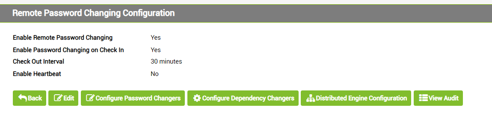

__Configure a Secret for Check Out__

Enable Check Out with Change Password on Check In to ensure that the password
for your privileged account is changed after each use. To do so, use the
following steps:

1. Find your __privileged account Secret__.
1. Click __View__.
1. Click the __Security__ tab.
1. Click __Edit__.
1. Select the Require __Check Out check box__, and then select the __Change
Password On Check In__ check box as well.
1. Click __Custom__.
1. Enter __a period of time__ that you estimate will allow enough time for authenticated scanning to complete.
1. Click __Save__.

   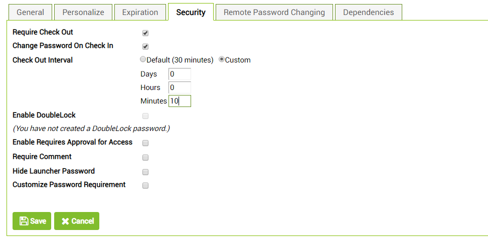
