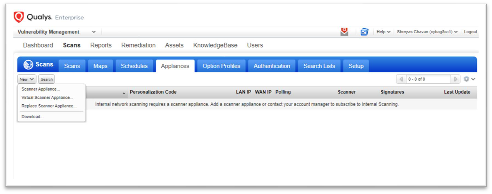
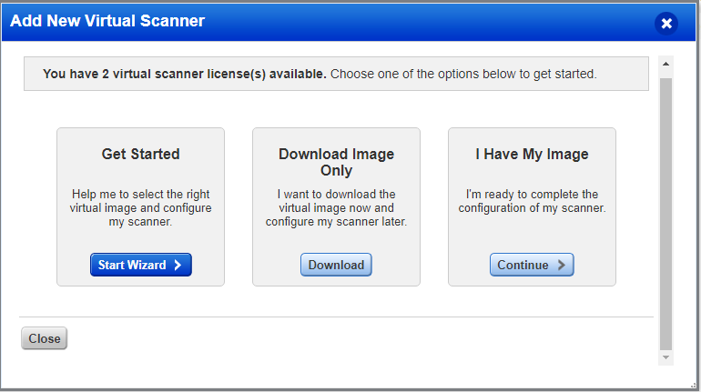
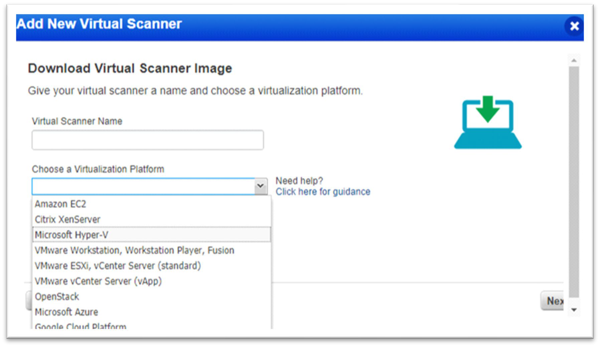
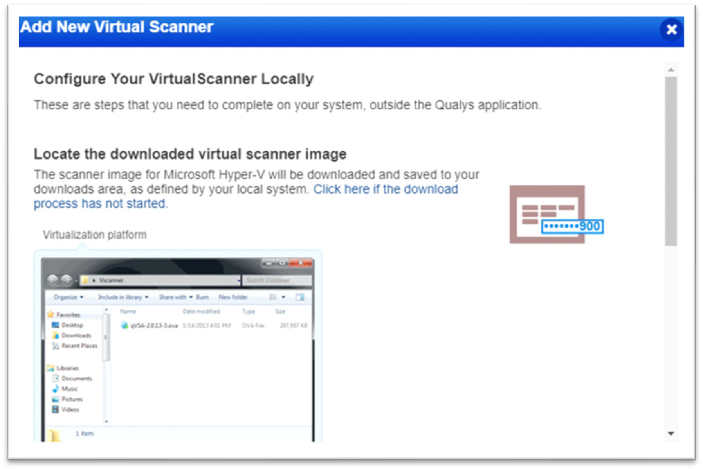
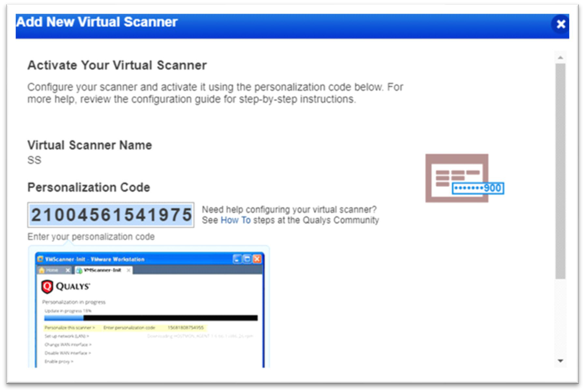
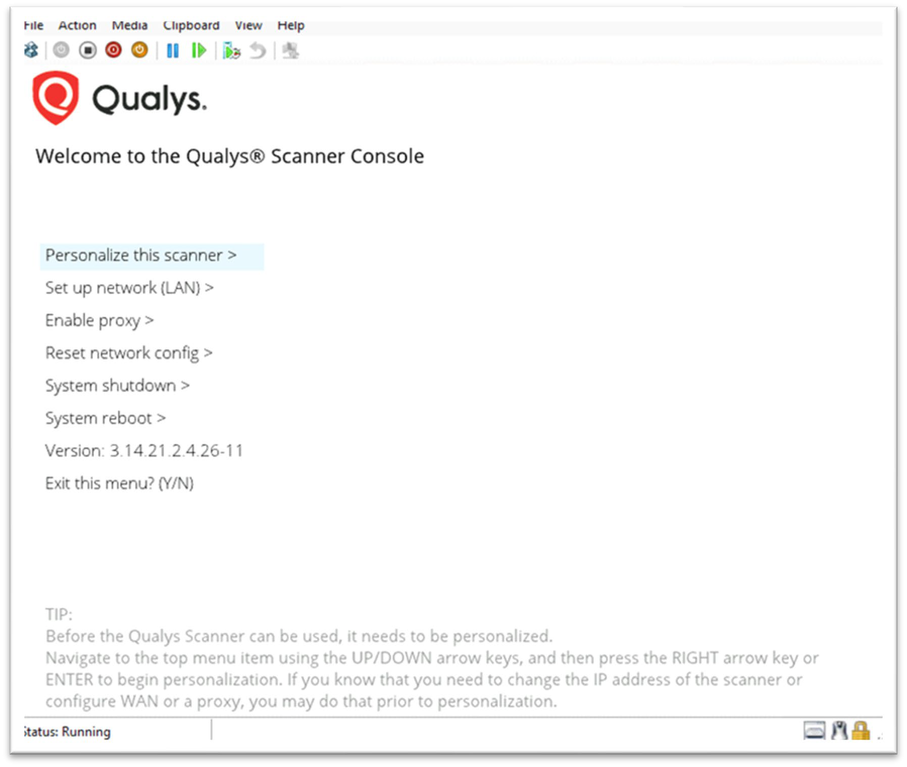
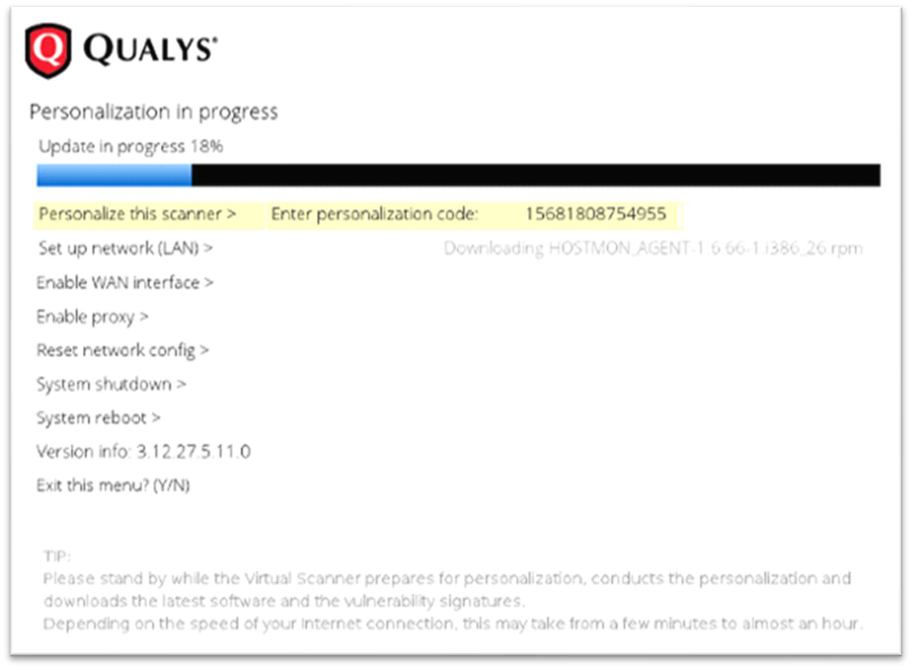
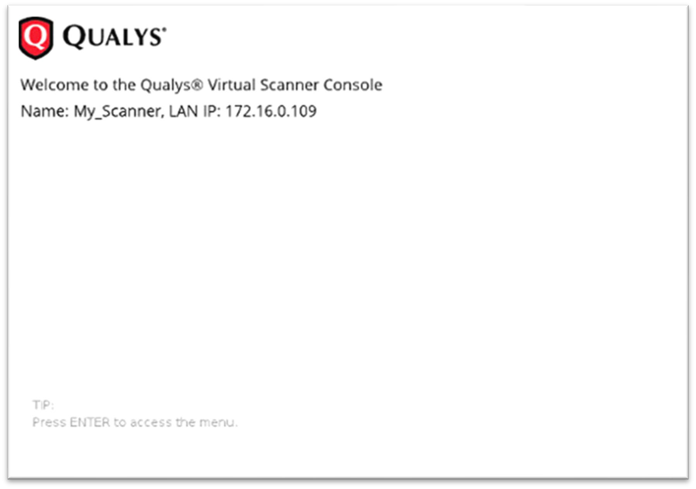
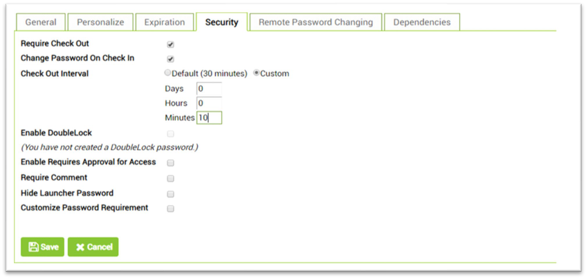

[title]: # (Scan for Vulnerabilities)
[tags]: # (scan, vulnerabilities)
[priority]: # (103)
# Scan for Vulnerabilities

It is important to scan your systems for known vulnerabilities to understand security risk. By automating scans, you'll get up to date security intelligence in real time.

## Launch a Vulnerability Scan

1. Navigate to __Scans | Scans | New | Scan__ (or Schedule
    Scan). The Launch Vulnerability Scan window will open.

   >__Note__: If Scanner Appliance: field reads _Scanner Appliance not available,_ it must be set up.

   

## Set up Scanner Appliance

1. Navigate to __Scans | Appliances | Select__ option.

   
1. Navigate to __Scans | Appliances | New | Virtual Scanner Appliance__.

   
1. Click __Start Wizard__.
1. Enter the scanner name and select __the preferred virtualization platform__.

   
1. Download the __Virtual Scanner Image__.

   >**Note:** This step applies to virtualization platforms with a scanner appliance image download (e.g. for VMware, Citrix XenServer, etc.)

1. Locate the Virtual Scanner Image on your local system.

   
1. Copy the __Personalization code__ to a safe place as it will be required later.

   
1. Personalize Your Scanner Local system or server.

These steps apply when you have downloaded a scanner appliance image (i.e. for VMware, Citrix XenServer, etc.). You’ll use Virtual Scanner Console running on your virtualization software to complete these steps.

## Configure a Virtual Scanner using Microsoft Hyper-V

   >**Note:** The following steps assume you have downloaded the virtual scanner image (qVSA-2.0.13-1- vhd.zip or later) and obtained a personalization code as noted in the above sections.

1. Start the virtual scanner machine.

1. Unzip the downloaded file: qVSA.i386-2.4.26-11.vhd.zip to obtain the virtual hard disk file: qVSA.i386-2.4.26-11.vhd.zip.

1. Log in to the Hyper-V server.

1. Navigate to __Manager__ | __Hyper-V Manager__ | __add a new Virtual Machine__.

1. Provide a name for the scanner.

1. Configure the memory. (Recommended is 2048 MB or more.)

1. Configure the networking as appropriate so the network adapter on the scanner can use a virtual network for communication.

1. For the virtual hard disk configuration, select __Use an existing virtual hard disk__ and provide the location of the .vhd file obtained from the download .zip file.

1. Click __Next__ and then __Finish__.

## Personalize the Virtual Scanner

The virtual scanner will use Dynamic Host Configuration Protocol (DHCP) without proxy configuration, unless custom settings are required. (For custom configuration: __Set up network (LAN)__.)

1. Click __Personalize this scanner__.

   
1. Enter the __personalization code__.

One activation code is used to activate one virtual scanner. After enteringthe code, the activation process begins, and the service reports the progress. Activation may take a few minutes to complete.

   

Upon success, the scanner’s friendly name and IP address appear, and the scanner is ready to be used for scanning.

1. Press __Enter__ to go to the main menu.

   

## Auto Change Passwords After Each Scan

You can leverage Secret Server’s Check Out feature to ensure passwords used for authenticated scanning are changed after use. This is an important measure in protecting privileged accounts from “Pass-the- Hash” attacks, because it means that the password hash stored in each machine from use during scanning will no longer be valid once the password has been changed in Active Directory. Check Out with Change Password on Check In means the password for your domain account will be changed automatically after scanning is complete.

   >**Note:** Check Out requires Enterprise or Enterprise Plus edition.

To verify Password Changing on Check In is enabled, perform the following:

1. From the Admin menu, navigate to __Remote Password Changing__.
1. If Enable Password Changing on Check In is set to __No__ or doesn’t appear, click __Edit__ to ensure the Enable Remote Password Changing and Enable Password Changing on Check In check boxes are both selected.
1. Click __Save__.

   

## Configure a Secret for Check Out

Enable Check Out with Change Password on Check In to ensure the password for privileged accounts is changed after each use.

1. Navigate to your privileged account Secret and click __View__.
1. Click the __Security | Edit__.
1. Select the __Require Check Out__ check box, and then select the __Change Password On Check In__.
1. Click __Custom__ and enter the estimated time period for authenticated scanning to complete.
1. Click __Save__.

   
