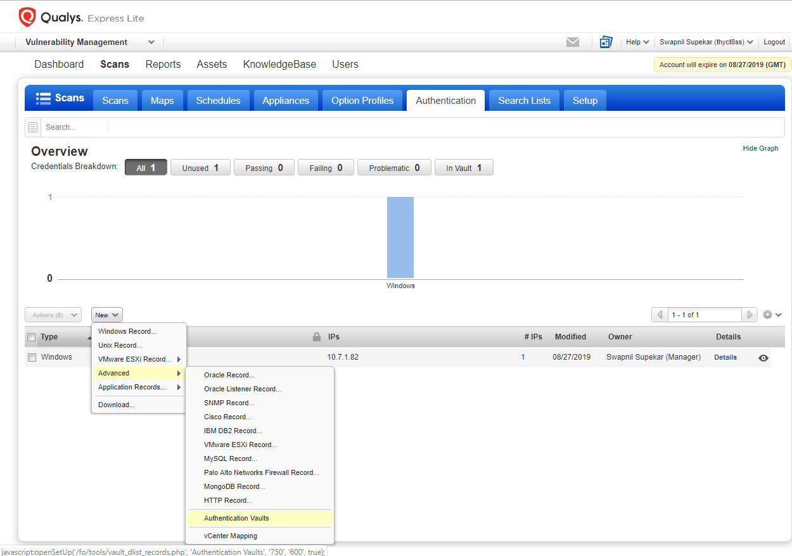
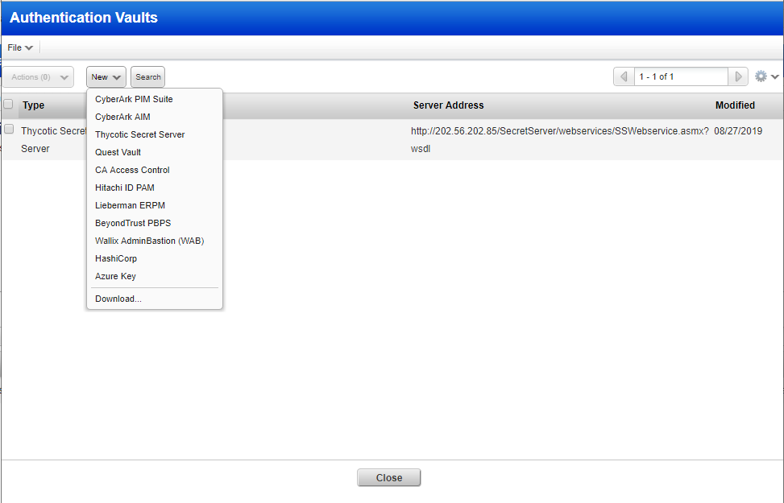
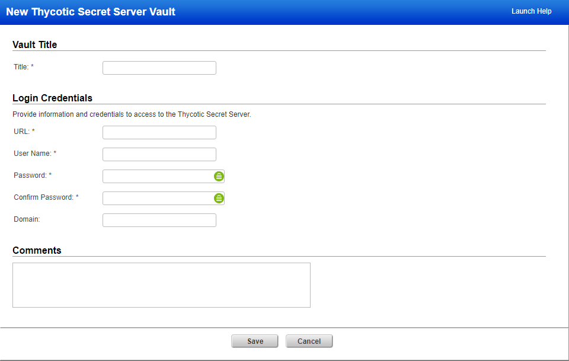
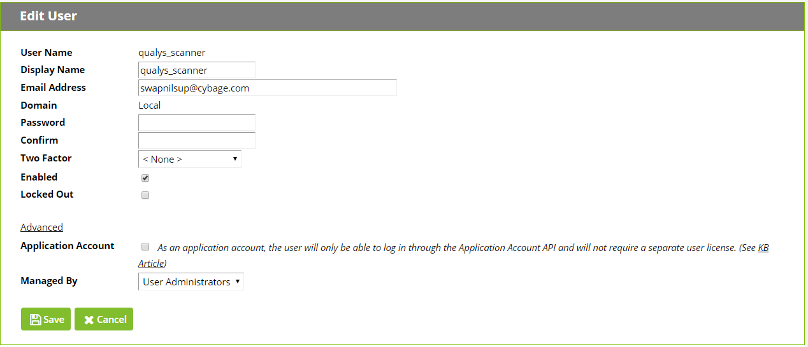

[title]: # (Setting up the Vault)
[tags]: # (vault)
[priority]: # (101)
# Setting up the Vault

To use Secret Server, an administrator must configure it as a Vault within
Qualys by specifying a URL and credentials to access the on-premises Secret
Server instance. Instead of adding username/password credentials for use in
trusted scans, the administrator can point to named records that are stored in
Secret Server. Qualys will retrieve the credentials from Secret Server at scan
time for trusted scans.

The first step is to add a new Authentication Vault in Qualys. To do so,
navigate to the **Authentication** tab and select **Authentication Vaults** from
the **New** menu (Figure 1) and (Figure 2).

   

Figure 1: Adding authentication vault

   

Figure 2: Creating Thycotic Secret Server Authentication vault

Select **Thycotic Secret Server** from the list of vaults. Enter the following
access information for your Secret Server site:

**URL This** is the URL for Secret Server web services. Ensure that web services
are enabled in your Secret Server instance by clicking **Configuration** from
the **Administration** menu and enabling web services.

Add /sswebservices/sswebservice.asmx to your Secret Server URL to obtain the URL
for the web services:

*https://yoursecretserver/sswebservices/sswebservice.asmx*

If you do not have SSL enabled, web services can be accessed on http, but that
is not advisable for production systems. The vault is accessed from the scan
agent, so the Secret Server website must be reachable from the Qualys scanner
appliance, not the Qualys cloud instance.

**User Name** The user account for accessing Secret Server. This can either be
local Secret Server account, or an Active Directory account. User accounts can
be created in Secret Server from the **Users** section of the **Administration**
menu (Figure 3). This user account should be application account. Click on
Advance Option and click the checkbox of Application Account and SAVE.

Figure 3: Qualys Secret Server user account
