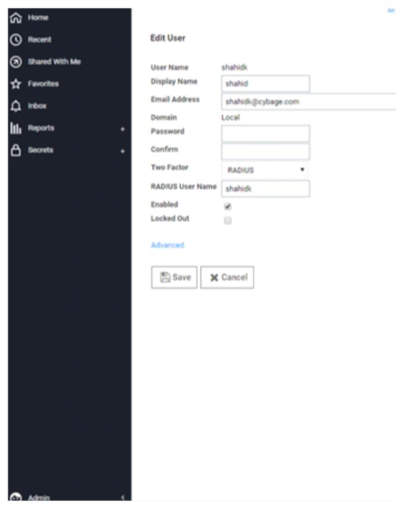

[title]: # (Configure RADIUS for the Secret Server)
[tags]: # (introduction)
[priority]: # (103)
# Configure RADIUS for the Secret Server Instance

## Enable RADIUS Two-Factor Authentication in Thycotic Secret Server 10.6 version

Secret Server allows the use of RADIUS two-factor authentication on top of the normal authentication process for additional security needs.

## Configure RADIUS for the Secret Server Instance

1. Sign intoan account withAdminister Configuration and Administer RADIUS permissions.
1. Navigate to __Administration menu | Configuration | Login__.
1. Enable Secret Server with your RADIUS server information by going into edit mode.
   * RADIUS Server IP(IP address to your RADIUS Server).
   * RADIUS Client Port(default 1812)

   >**Note:**  If your RADIUS server runs on the same machine as your Secret Server, client and server ports must be different.
      * RADIUS Server Port(default 1812 for RSA and 1812 for AuthAnvil).
      * RADIUS Shared Secret must match chosen RADIUS shared secret on your RADIUS Server.(Shared Secret is a RADIUS term and not related to any Secret Server secret.)
      * RADIUS Login explanation(custom message or instruction). Defaults to Please enter your RADIUS passcode.

1. Click __Save__ after entries are confirmed.

## Test RADIUS settings

1. Click the __Test RADIUS Login__ button.

   

   >**Note:** After enabling RADIUS on your Secret Server, you must enable RADIUS two-factor authentication for each user. You can enable it on a per-user basis.

1. Sign intoan account withAdminister ConfigurationandAdminister RADIUSpermissions.
1. Navigate to __Administration > Users > Username__ of user to enable.
1. Click the __Edit__ button and check the __RADIUS Two Factor Authentication__ check box.
1. Enter the __RADIUS username__ in the text field.  

   >**Note:** Secret Server defaults this value to its username. If you wish to use this default name, it must match the username on the RADIUS server.

1. Review the settings and click __Save__.
1. Repeat 3-5 for each user.

   

## Validate Authentication through RADIUS Server

1. Sign into __Secret Server__. The RADIUS Authentication screen appears.

   
1. Enter your __RADIUS user password__ created in AuthAnvil On-Demand.

You should be successfully loggedinto Secret Server using two-factorauthentication through RADIUS.