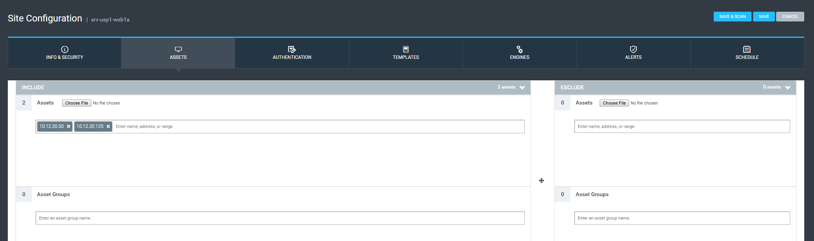

[title]: # (Configure the Ruby Interpreter)
[tags]: # (configure)
[priority]: # (102)
# Configure the Ruby Interpreter

Configure the Thycotic Gem to import Thycotic credentials into the Nexpose
vulnerability management system. The script you will use requires a Ruby
interpreter and must be installed on the system where it is going to run.

1.  View the options for [installing Ruby](https://www.ruby-lang.org/en/) on
    various platforms and choose the most appropriate version.

2.  Once installed, this [Ruby Gem](http://rubygems.org/gems/nexpose_thycotic)
    must also be installed: nexpose_thycotic 0.2.0.

3.  This can be either manually downloaded or through the GEM application
    repositories: gem install nexpose_thycotic.

   