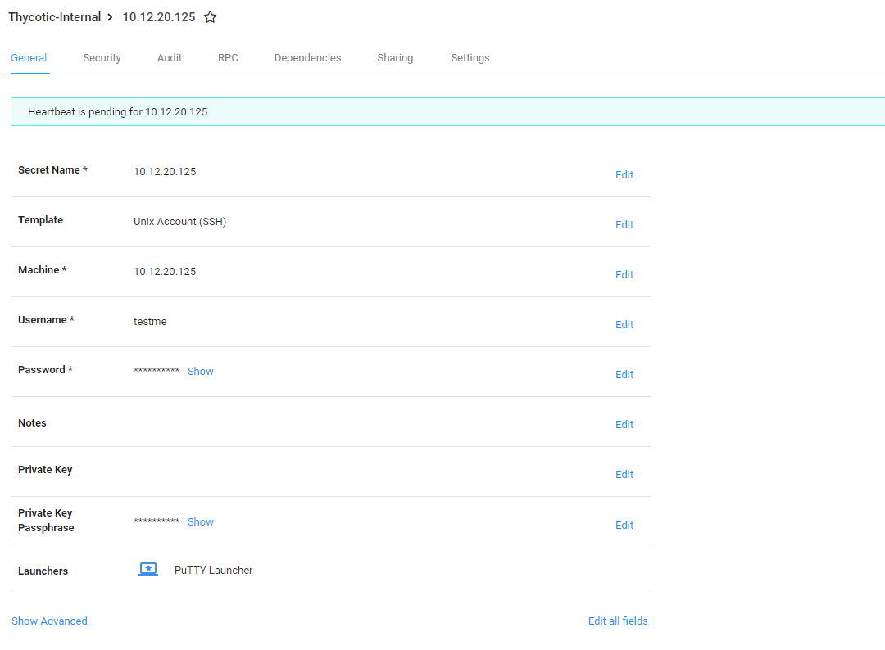
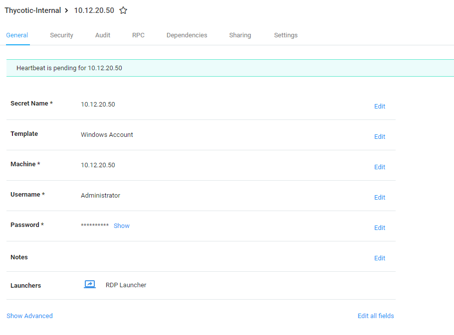
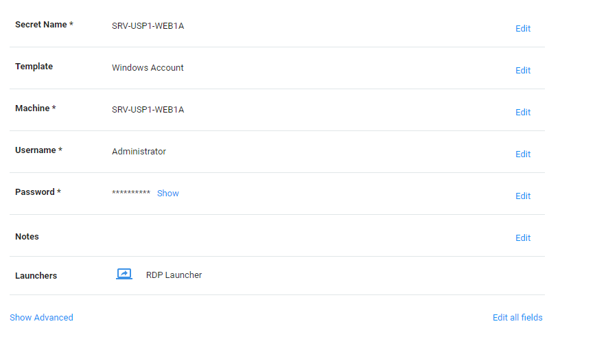

[title]: # (Configure the Environment)
[tags]: # (configure)
[priority]: # (101)
# Configure the Environment

1.  Enable the SS Web Service API in the user interface:

-   Navigate to Admin \> Configuration \> General tab.

-   Set the Enable Webservices option to Yes.

1.  Ensure the assets to be managed have the following characteristics:

-   The Secret name must be the same as the IP address or host name within the
    Secret itself. It is required that the Machine field is explicitly an IP
    address or short hostname value. To keep the examples simple, the secrets
    are named the same as the machine values.

Linux Template example using IP address:

Windows Template example using IP address:

Windows Template example using Hostname:

-   The Secret template must be one of the defaults: Unix Account (SSH) for
    Unix/Linux systems and Windows Account for CIFS/Windows systems.

1.  Create sites in InsightVM or Nexpose with assets to work with SS. You can
    manually create the assets in InsightVM or Nexpose or import them from a
    list. Note that you currently cannot enter a CIDR range. You must have
    individual entries for each asset to be included in the Rapid7 integration.