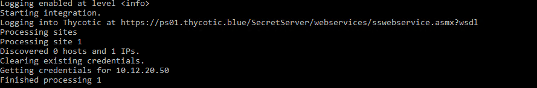
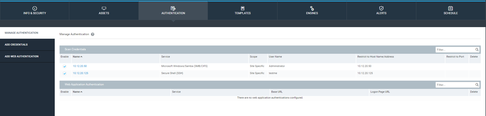

[title]: # (Configure and run the Script)
[tags]: # (introduction)
[priority]: # (103)
# Configure and Run the Script

Once all dependencies have been installed, configure the script:

1. Open the Nexpose\\_Thycotic.config file located in the Ruby installation folder.
For example:`C:\\Ruby25-x64\\lib\\ruby\\gems\\2.5.0\\gems\\Nexpose\\_Thycotic-02.0\\lib\\Nexpose\\_Thycotic\\config`.

## Configure Secret Server

Set up the following options for the user who is running the Gem:

* __Thycotic url:__ The IP address for the Secret Server instance with WSDL. For
    example: https://127.0.0.1/SecretServer/webservices/sswebservice.asmx?wsdl.

* __Thycotic username:__ The username configured in Secret Server.

* __Thycotic passsword:__ The password for that Secret Server user.

* __Comment:__ The comment used when retrieving each password.

## Configure Nexpose settings

* __Nexpose url:__ The URL/IP For the Nexpose instance. 
For example: https://192.168.0.1/.

* __Nexpose username:__ The username in Nexpose.

* __Nexpose password:__ The password for the user in Nexpose.

* __Nexpose port:__ Set if Nexpose was installed with a different port than the
    default 3780.

## Configure additional settings

* __Sites:__ Sites to manage. There can be more than one site.

* __Clear creds:__ Set to True to delete all pre-existing credentials when
    importing from SS.

* __Logging enabled:__ Enables logging to the log directory.

* __Log level:__ Default is info but can be set to debug, warn, or error.

* __Log console:__ Determines if log messages are output to the console.

Step Four: Run the Script
-------------------------

1. Run the script from the command line: `ruby Nexpose\\_Thycotic`.
1. The scriptruns and performs the queries.
1. On windows systems, you can also run the Nexpose_tycotic command from the `C:\\Ruby25-x64\\bin directory`.

The credentials will then be available for each asset in your newly existing
site(s). This can be verified by the following lines in the script output and in
the Authentication Tab of the site for each asset.

