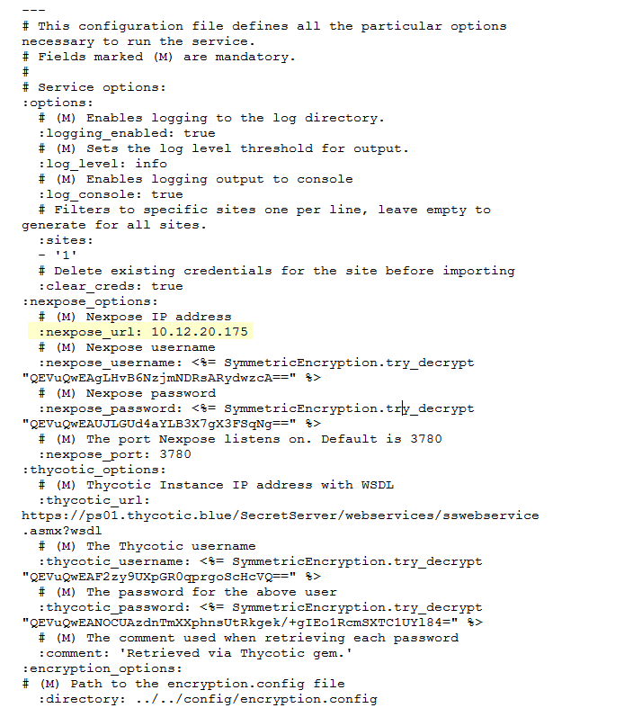

[title]: # (Troubleshooting)
[tags]: # (introduction)
[priority]: # (500)
# Troubleshooting

The most common script errors are configuration based.
Such as, users without permission to update sites or query credentials from Secret Server. 

## To begin Troubleshooting

1. Ensure secrets have the same name in Nexpose and in SS. (IP address or short name hostname only for secret name and machine name.)
1. Ensure the cited Nexpose user can save sites and start scans.

1. The encryption.config file shown above does not reference Thycotic’s encryption.config file, nor does it need copied to the location specified for this integration to work.
1. Ensure the nexpose_url reflects the actual IP address assigned to the network adapter attached to the system running the script and not a localhost value.
1. If issues still exist, email support\@rapid7.com.
