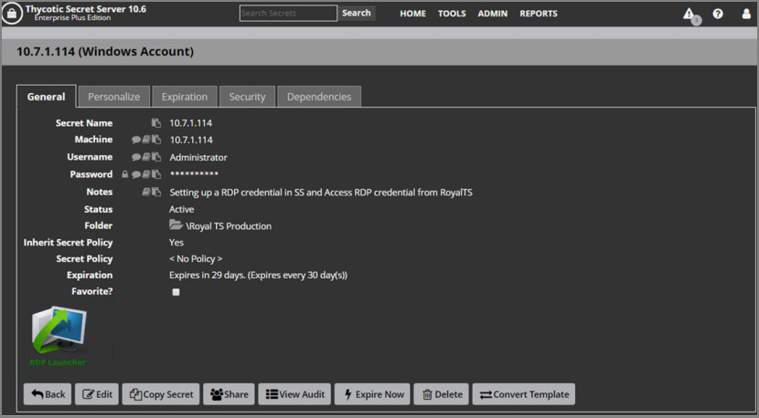
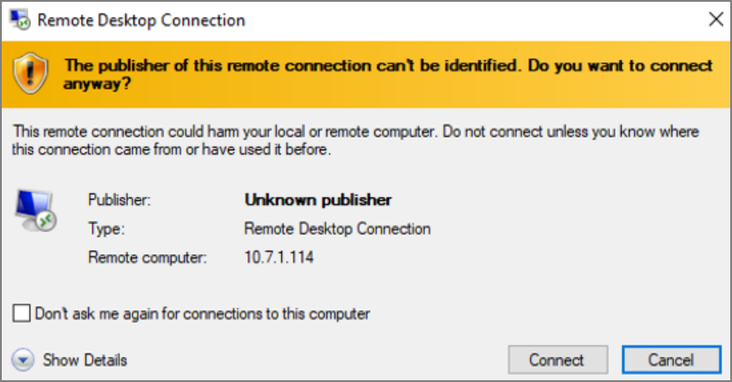
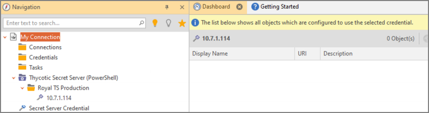
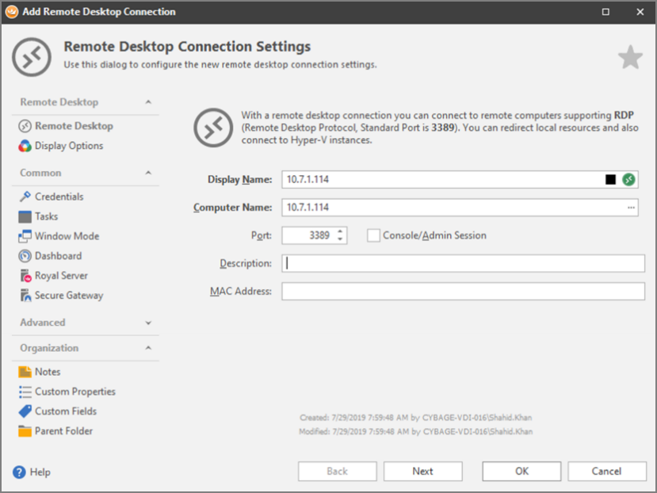
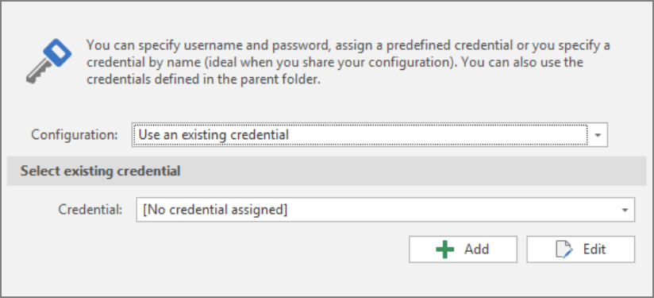
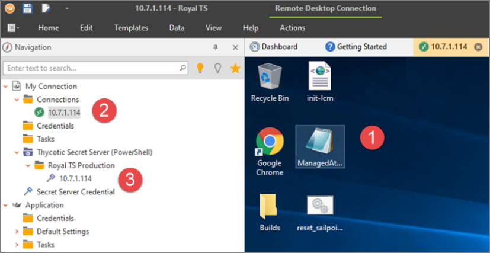
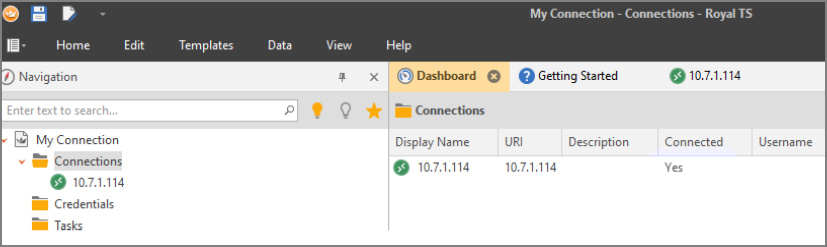

[title]: # (Create an RDP Credential in Secret Server)
[tags]: # (integration)
[priority]: # (105)
# Create an RDP Credential in Secret Server

1. Create a secret in SS using the Window Account secret template:

   

1. Click the Save button. The new secret appears:

   

1. Click the **RDP Launcher** button. The session launches, and a confirmation dialog box appears.

1. Click the **Open RDPWinBootstrapper** button. The session connects with the target server, and an RDP dialog box appears:

   

1. Click the **Connect** button. The text "Active Session" appears below the RDP Launcher button.

1. Return to RTS.

1. Once again, reload the dynamic folder. The Window Account secret appears in RTS:

   

1. Right-click the **Connections** folder and select **Add \> Remote Desktop**. The Add Remote Desktop Connection wizard appears:

   

1. Click the Credentials button:

   

1. If necessary, click the **Configuration** dropdown list and select **Use an existing credential**.

1. Click the **Credential** dropdown list and select the credential you created earlier.

1. Click the **OK** button. The wizard closes.

1. Click to expand the **Connections** folder under your connection.

1. Right-click the connection you created and select Connect. Your new session will appear as a new tab in RTS:

   
   	**1:** The new RDP session appears in its own tab.
   
   ​	**2:** The existing credential is used to connect with the 10.7.1.114 server.

   ​	**3:** The fetched credential from the Window Account secret from SS.

   And "Yes" appears in the Connected column for that server's connection:

   
   
   

> **Note:** If you try to connect to the server and get a "Windows Security: Your credentials did not work" error, try correcting the password in the Windows Account secret in SS and reloading the dynamic folder in RTS.