[title]: # (Configure RTS for Integration)
[tags]: # (integration)
[priority]: # (102)
# Configure RTS for Integration

1. Start __RTS__.
   
   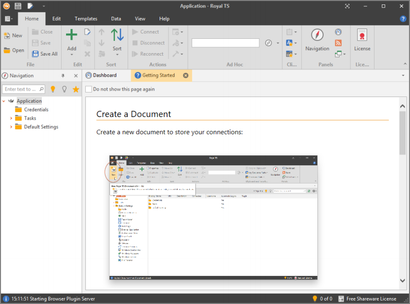
1. Click the **New** button. The Add Royal TS Document wizard appears:

   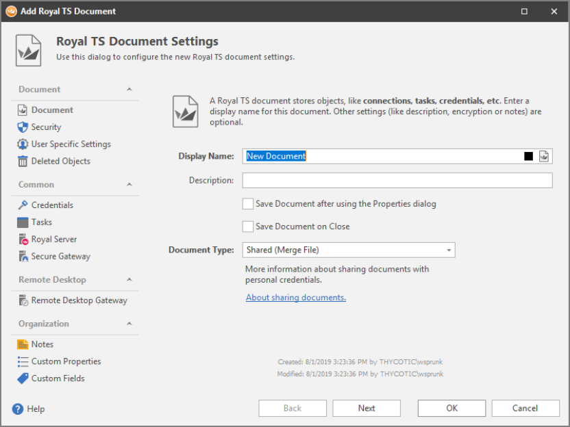
1. Type a name for the document in the **Display Name** text box.
1. Click the **Next** button:

   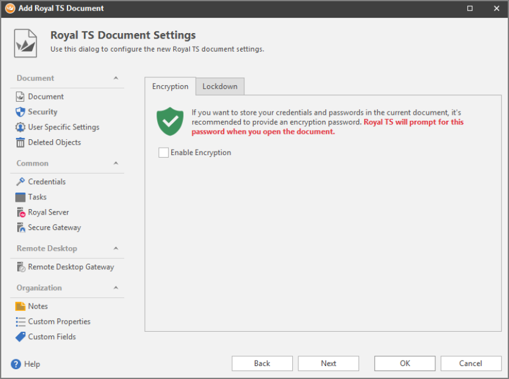
1. Click to enable the **Enable Encryption** check box:

   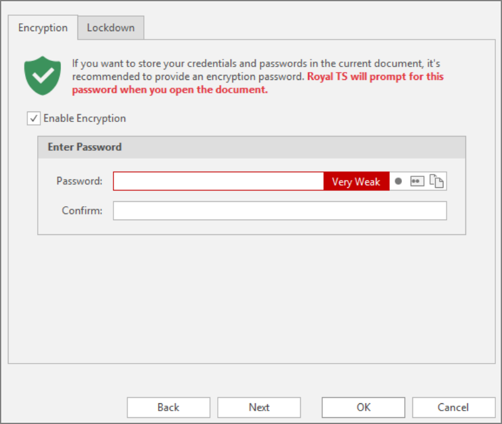
1. Type the desired password in the **Password** and **Confirm** text boxes. You can also click the **Generate Password** button to the right to automatically create one.

1. Click the **OK** button. The wizard closes and your new connection appears as a node in the tree in the left pane.

1. Navigate to the dynamic folder PowerShell file for Secret Server at [https://github.com/royalapplications/toolbox/tree/master/Dynamic%20Folder/Thycotic%20Secret%20Server](https://github.com/royalapplications/toolbox/tree/master/DynamicFolder/ThycoticSecretServer):

   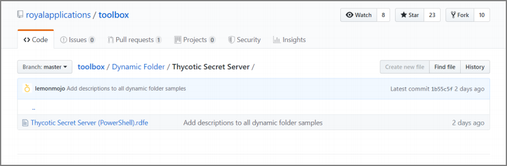
   
1. Click the **Thycotic Secret Server (PowerShell).rdfe** link to open the file.

   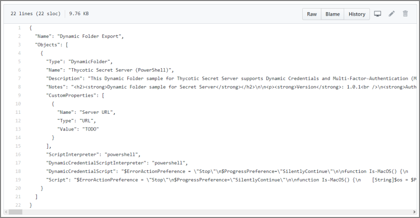

1. Right-click the **Raw** button and select **Save link as…** or **Save linked content as…** to save the PowerShell .rdfe file to a location of your choice. It probably defaults to your Downloads folder.

1. Return to RTS.

1. Click the new **Connection** node in the navigation tree.

1. Click the **Data** tab:

   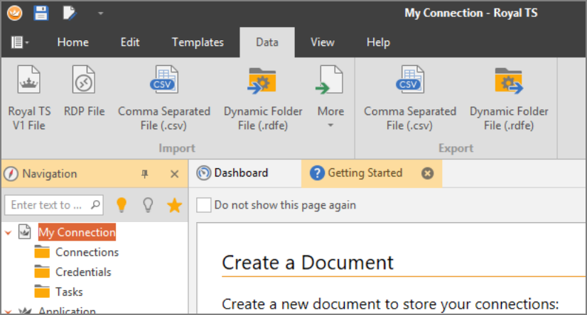

1. Click the **Dynamic Folder File** button in the **Import** section.

1. Locate the file you downloaded.

1. Click the **Open** button to import the file. A confirmation popup and then the Edit Properties popup appears:

    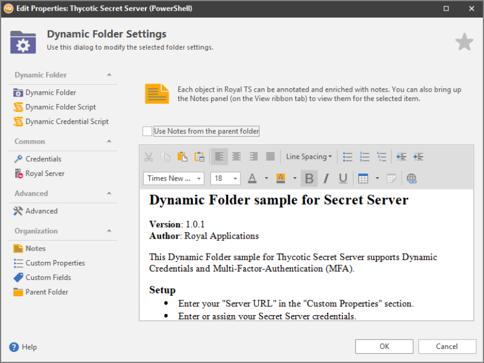

    You cannot see it yet, but a new dynamic folder appears under your connections

    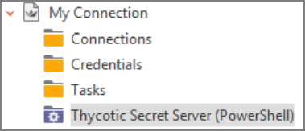

1. Click the Custom Properties button on the left:

   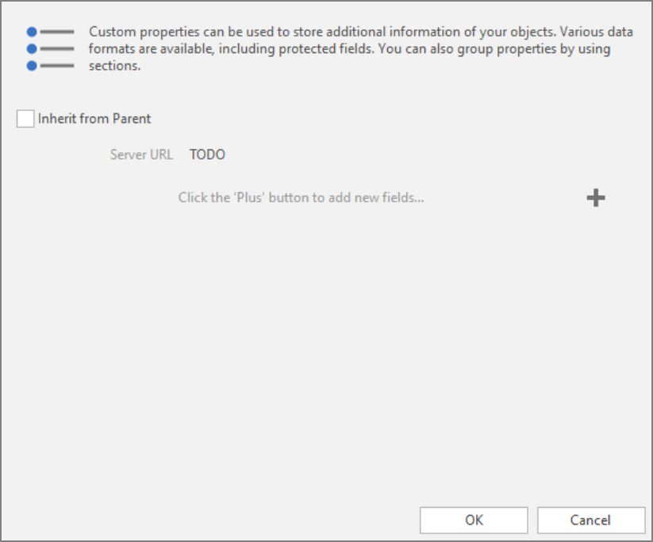

1. Click the "TODO" next to Server URL to make a text box appear.

1. Type your server URL in the text box.

1. Click the **OK** button.

1. If multi-factor authentication (MFA) is required by your server or user:

   1. Right click the Thycotic Secret Server (PowerShell) connection and select **Properties**. The Edit Properties wizard appears:

      

   1. Click the **Dynamic Folder Script** button. The script appears:

      

   1. Scroll down to the very last line of the script:

      `Get-Entries -url "$CustomProperty.ServerURL$" -username "$EffectiveUsername$" -password "$EffectivePassword$" -requiresMFA $false`

   1. Change the `$false` to `$true`.

   1. Click the **OK** button.

   1. Repeat the process for the Dynamic Credential script.
   
1. Click the **Credentials** button. The Edit Properties wizard appears:

   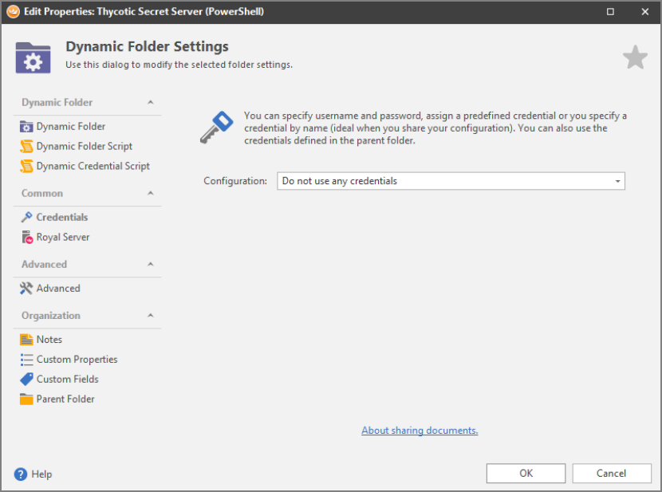

1. Click the **Configuration** dropdown list and select either **Specify username and password** or **Use an existing credential**.

1. If chose the former, type your information in the **Username** and Password text boxes:

   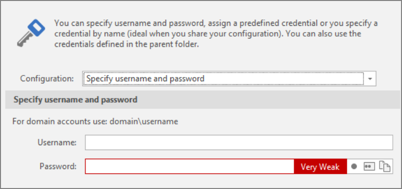

1. If you chose the latter, select an existing credential from the **Credential** dropdown list. If your credential is not in the list, click the **+ Add** button to add it.

    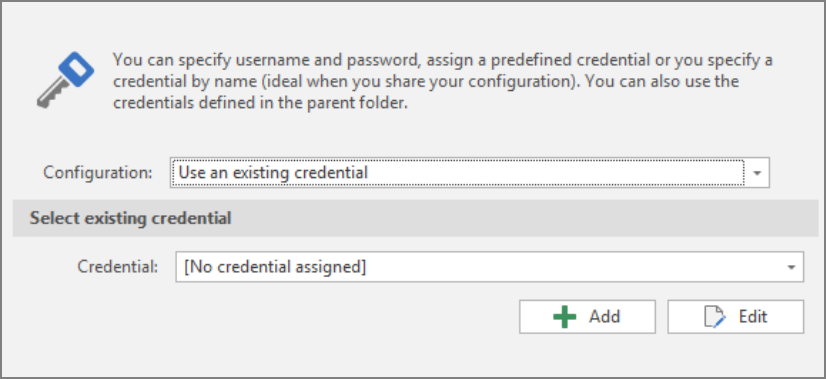

1. Click the **OK** button.

1. Click the **Dynamic Folder Script** button. The script editor appears:

   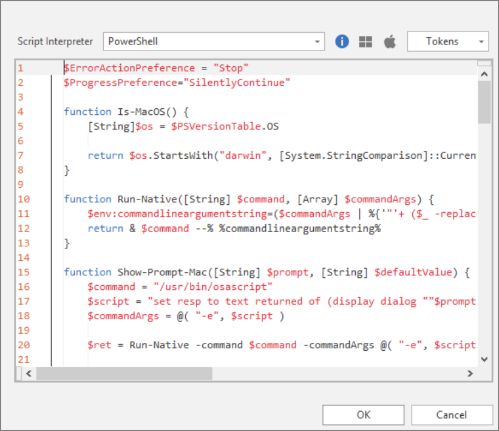

1. Click the blue information button. The Script Interpreter Path Configuration dialog box appears:

   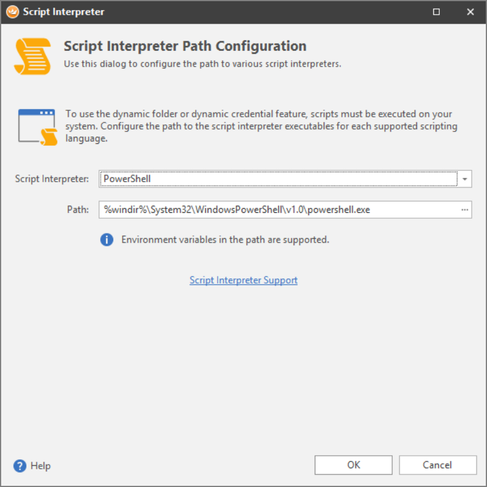

1. Ensure the path to your installed `powershell.exe` file is correct. If not navigate to the correct path and click the **Open** button.