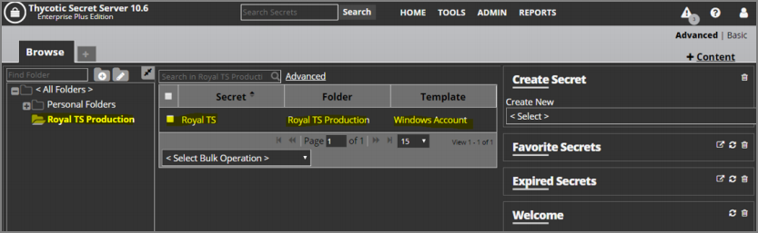
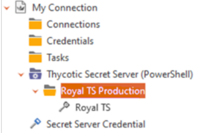

[title]: # (Configure Secret Server for Integration)
[tags]: # (integration)
[priority]: # (103)
# Configure Secret Server for Integration

1. Log into SS using the credentials assigned to the dynamic folder

2. Create a RTS folder and secret:

   

3. Return to the RTS application.

4. Right click the SS dynamic folder in the tree and select **Reload**. The secret you created in SS is pulled into your dynamic folder:

   

   > **Note:** If you want to view your user ID and password, you can right-click the credential for the dynamic folder and select Copy to Clipboard.