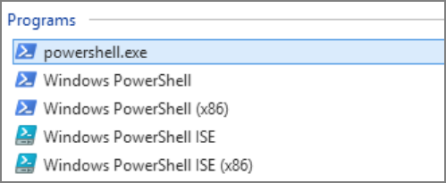

[title]: # (Prerequisites for Integration)
[tags]: # (integration)
[priority]: # (101)
# Prerequisites for Integration

1. Navigate to https://www.royalapps.com/server/main/download and __download__ RTS for Windows 5.0.

1. Install __RTS__ for Windows.

   > **Note:** You can download, install, and use RTS products free without any time limit, license key, or registration. This allows you to get started quickly. If have a small environment, you can continue using our products free of charge in "Shareware Mode."
   >
   > **Note:** We recommend that you *do not* associate RTS with the Remote Desktop connection file (.rdp) extension.
   >
   > **Note:** It can take RTS for Windows several minutes to install and optimize itself.

1. Ensure Windows PowerShell ISE (Integrated Scripting Environment) is on your Windows installation:
1. Click your Windows __Start__ button.
1. Type `PowerShell` in the search text box:
   
   
1. Ensure the Windows PowerShell ISE entry appears as a choice.
   
   > **Important:** The script that you will run is designed for PowerShell 6, so please ensure you have that version.
   >
   > **Note:** Each version of Windows and Windows Server includes a version of Windows PowerShell and the ISE. If you suspect yours is out of date, you can upgrade to the latest available by installing the latest Windows Management Framework (WMF). 