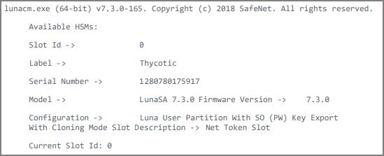
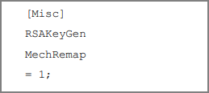

[title]: # (Configure SafeNet Luna HSM)
[tags]: # (configure)
[priority]: # (101)
# Configure SafeNet Luna HSM

Before you get started, ensure the following:

-   Ensure the HSM is setup, initialized, provisioned, and ready for deployment.

-   Create a partition on the HSM that will be later used by Thycotic Secret
    Server.

-   If using a SafeNet Luna Network HSM, register a client for the system and
    assign the client to the partition to create an NTLS connection. Initialize
    Crypto Officer and Crypto User roles for the registered partition.

-   Ensure that the partition is successfully registered and configured. The command to see the registered partition is:

   

   >**Note**: Follow the steps mentioned in *SafeNet Network Luna HSM documentation* for creating NTLS connection, initializing the partition, and various user roles.

Using SafeNet HSM in FIPS Mode
------------------------------

Under FIPS 186-3/4, the RSA methods permitted for generating keys are 186-3 with primes and 186-3 with aux primes. This means that RSA PKCS and X9.31 key generation is no longer approved for operation in a FIPS- compliant HSM. If you
are using the SafeNet HSM in FIPS mode, you must make the following change to the configuration file:

   

This setting redirects the older calling mechanism to a new approved mechanism
when SafeNet HSM is in FIPS mode.

Provision HSM on Demand Service
-------------------------------

This DPoD service provides your client machine with access to an HSM Application
Partition for storing cryptographic objects used by your applications.
Application partitions can be assigned to a single client, or multiple clients
can be assigned to, and share a single application partition.

To use the HSM on Demand service, you need to provision your application
partition by initializing the following roles:

-   **Security Officer (SO)** - responsible for setting the partition policies
    and for creating the Crypto Officer.

-   **Crypto Officer (CO)** - responsible for creating, modifying, and deleting
    crypto objects within the partition.

-   The CO can use the crypto objects and create an optional, limited-capability
    role called Crypto User that can use the crypto objects but cannot modify
    them.

-   **Crypto User (CU)** - optional role that can use crypto objects while
    performing cryptographic operations.