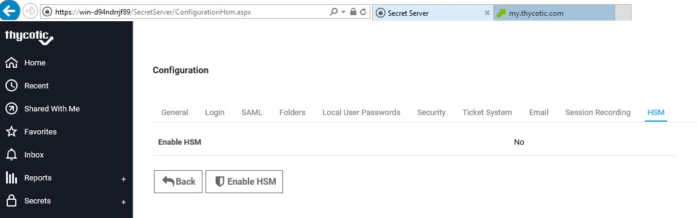
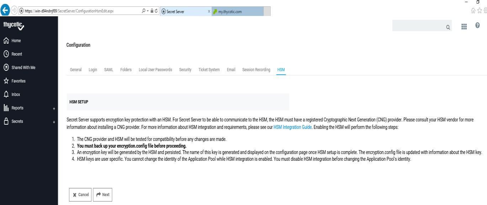
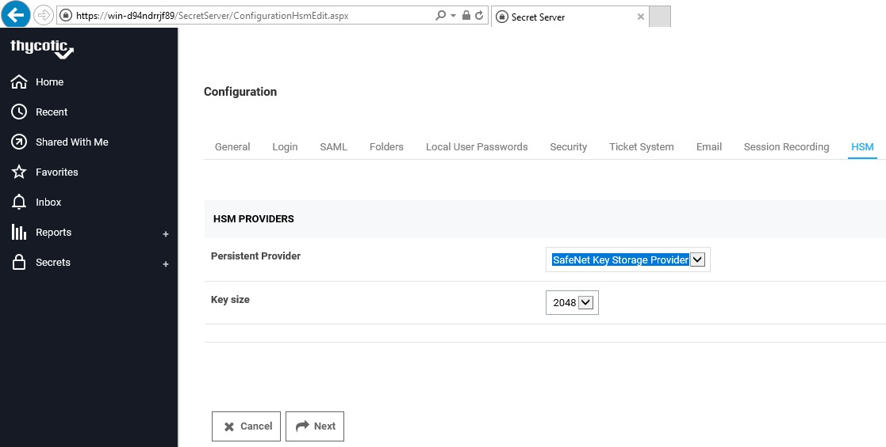
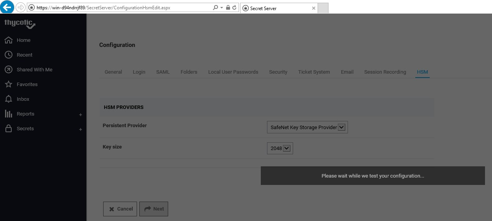
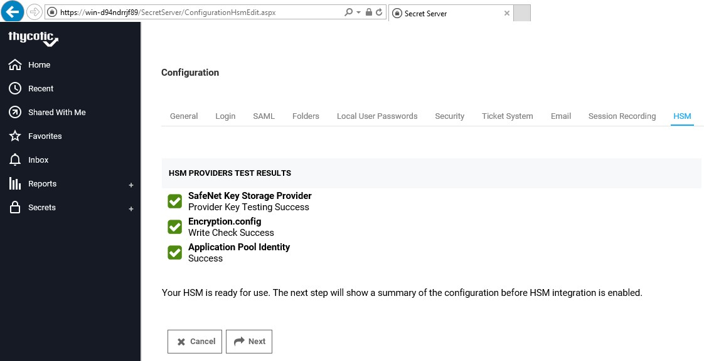
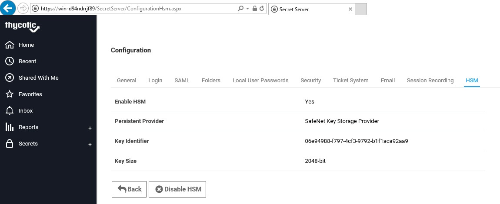
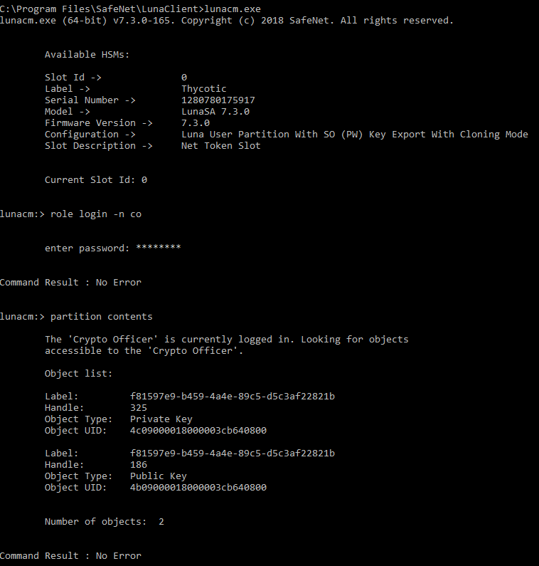

[title]: # (Integrate Secret Server with a SafeNet HSM)
[tags]: # (integrate)
[priority]: # (102)
# Integrate Secret Server with a SafeNet HSM

Setup Thycotic Secret Server
----------------------------

Install Thycotic Secret Server on the target machine. Refer to the *Thycotic
documentation* for detailed installation instructions.

Integrate Secret Server with a SafeNet HSM
==========================================

To integrate Thycotic Secret Server with the SafeNet HSM, complete the following
steps in each section.

Configure the SafeNet Key Storage Provider (KSP)
------------------------------------------------

1.  Navigate to the **\<SafeNet HSM Client installation Directory\>\\KSP**
    directory. If using an HSMoD service, the /KSP folder is available in the
    service client package.

2.  Double-click **KspConfig.exe**. The SafeNet KSP configuration wizard
    displays.

3.  Double-click **Register or View Security Library** on the left side of the
    pane.

4.  Click **Browse** and select a cryptographic library such as \<**SafeNet HSM
    Client installation Directory\>\\cryptoki.dll\>**.

5.  Click **Register**. If using an HSMoD service, the cryptographic libraries
    are available in the service client package. On successful registration, a
    message "Success registering the security library" displays.

6.  Double-click **Register HSM Slots** on the left side of the pane.

7.  Enter the **Slot (Partition) password**.

8.  Click **Register Slot** to register the slot for Domain\\User. On successful
    registration, a message "The slot was successfully and securely registered"
    displays.

9.  Register the same slot for **NT_AUTHORITY\\SYSTEM**.

10. If using HSMoD service, place **SafeNetKSP.dll** in service client package
    under **C:\\Windows\\System32**.

11. Restart the IIS after registering KSP for changes to take effect.

Enable HSM
----------

1.  Go to the **Admin** menu and click **Configuration**.

2.  Select the **HSM** tab. This starts the HSM wizard, which guides the process
    of selecting the HSM’s CNG provider.

3.  Click **Enable HSM**.

The HSM Setup screen displays providing information about HSM integration.

Click **Next**.

1.  Select **SafeNet Key Storage Provider** from **Persistent Provider** drop
    down box under HSM PROVIDERS section.

2.  Select key size of RSA from **Key size** drop down box.

3.  Click **Next**.

Once SafeNet Key Storage Provider is selected, Secret Server stimulates
encryption and decryption operations.

Verify the results to ensure its functioning properly.

The HSM PROVIDERS TEST RESULTS section shows the result Success.

Click **Next**.

The HSM VERIFY CONFIGURATION screen displays. Review HSM configuration.

Click **Save**.

The HSM SETUP COMPLETE screen displays message, "The HSM is now enabled.”

Click **Finished**.

1.  Restart the IIS for configuration changes to take effect.

The HSM configuration is saved and can now be viewed under **HSM** tab.

The Secret Server encryption key is now stored on SafeNet HSM partition.

Verify the key using the lunacm utility.

This completes the integration of Thycotic Secret Server with SafeNet Luna HSM
or SafeNet Data Protection on Demand Service. Secrets now created in Thycotic
Secret Server will use encryption keys residing in HSM partition.