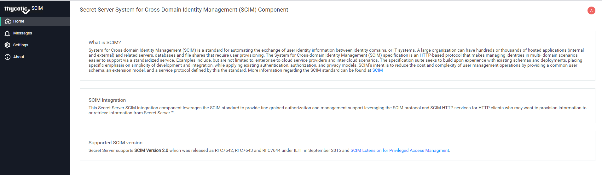

[title]: # (IdentityNow)
[tags]: # (configuration)
[priority]: # (3)
# Configuring IdentityNow with Secret Server

## Install the Thycotic SCIM connector

This SCIM installer can be located here
<https://thy.center/scim/link/SCIMdownload> and installed on any Windows Server running server 2016 or newer.

To install the SCIM connector please perform the
following steps. Instructions can also be found at
https://docs.thycotic.com/scim/2.5.0/install/standard-installation-process.md.

1. Download the install file onto your server.
1. Execute the file.
1. Clock on the __standard__ option for the install.

   
1. For the Standard option provide a name for the Application/Website on the server.

   
1. Click on __Accept the License Agreement__ statement.

   
1. Provide a file location to place the application files.

   
1. Click __install__, and complete the installation.

   

## Configure the SCIM connector to speak with Secret Server

Now that your SCIM connector is installed you will want to configure it to communicate with the secret server installation. Full configuration details can be found at <https://docs.thycotic.com/scim/2.5.0/config/scim-ui.md> or complete the following steps below.

1. Go to your SCIM website by default at <https://ServerName/ApplicationName>.

   
1. Click on __Settings__ from the left navigation panel.

   
1. In the first Tab enter your Secret Server information.

   * The __BaseURL:__ the BaseURL will be the URL to your Secret Server Installation.

   * __Username and Password:__ Username and password should be for a user with administrative rights inside SS (this will be the user that the SCMIN connector will use for API calls.

1. Click on __Save__ and it will launch a connection test.

   

## Configure the SCIM connector to speak with IdentityNow

While you are configuring your Secret Server is a good time to also configure the endpoint for IdentityNow. To do so please execute the following steps:

1. Click on the second tab __SCIM Connector Endpoints__.

   

1. Click on __Add Endpoint__.

   

1. Enter a Name for the Endpoint.

   >**Note:** The name for the endpoint needs to be unique in the SCIM connector, a username and password for your IdenitiyNow installation, the URL it can be located at, and an authentication token. This token can be generated in the API management section under security in the IdentityNow Admin console.

   

1. Click __Save__.

## Map Permissions in IdentityNow to secret access in Secret Server

Now that both systems are configured to communicate, you can map a permission inside of Identity Now to access secrets in Secret Server. In order to do this follow these steps.

1. Click on the second tab under the connector definition in you SCIM console __Advanced__.

    

1. Click on __Add Permission__.

    

1. Select a value for the following fields:

   * The endpoint value: should be the name of the role inside of IdenityNow

   * the Secret Server value: will be the role that this should map to inside of Secret Server

1. Once you save than the permissions roles on containers in IdenityNow you should begin to sync to the roles on the same folders inside of Secret Server.
