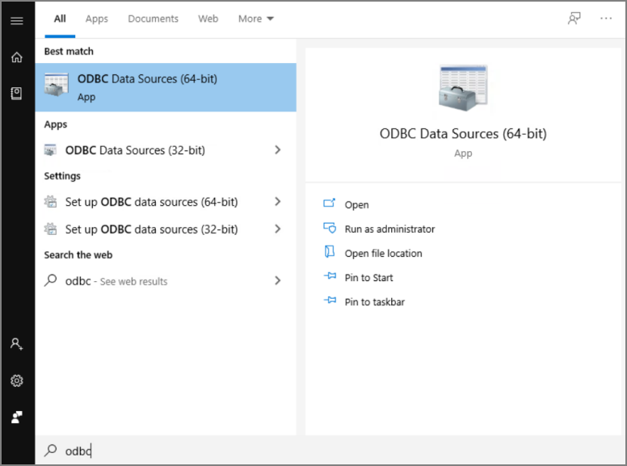

[title]: # (ODBC Driver Confirmation)
[tags]: # (odbc)
[priority]: # (101)
# ODBC Driver Confirmation

On the devices that either have Secret Server or the Distributed Engine installed upon them, ensure that the correct ODBC driver is available for the SAP Hana database type.

1. Open the __ODBC Data Sources__ application relevant for your Operating System bit type (64bit or 32bit).

   
1. Confirm that the __HDBOBDC__ driver is available under the __Drivers__ tab.

   
   >**Note:** Ensure that this version of the driver is compatible with the database instance that you are referencing interms of versions. For more information on this, please refer to SAP-specific documentation.
