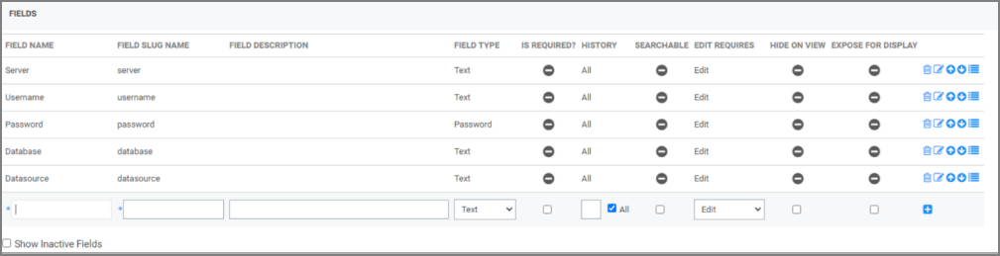
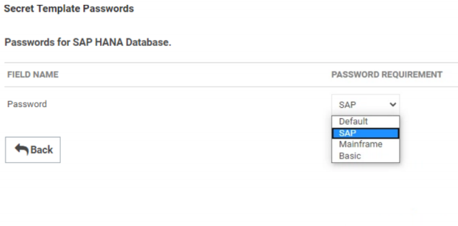

[title]: # (SAP HANA Template Creation)
[tags]: # (template)
[priority]: # (103)
# SAP HANA Template Creation

Now that we have created a password changer that we can leverage, we will need to create a Secret Template that will utilise it.

1. Head to __Admin | Secret Templates__. Click __Create New__ and give the template a relevant name – “SAP HANA Database”, for example.
1. The template will require the following fields:
   * __Server__
   * __Username__
   * __Password__ (type = “Password”)
   * __Database__
   * __Datasource__
Not all of these are used in our password changer, but they are all required.

   
1. Assign the __SAP__ password requirement by clicking on __Assign Password Requirement__ and modifying the value.

   
1. Click on __Configure Password Changing__ and select the SAP HANA Password Changer that was created in the __Password Changer Creation__ section of this document, as shown.

   
1. The template is now complete and ready for Secrets to be created against it.

It is worth noting that the Server field of the template should also include the port number against which the Secret is referencing, for example:

   `Hdbhost:39015`

An IP address can also be used instead of a hostname, where required.

   
