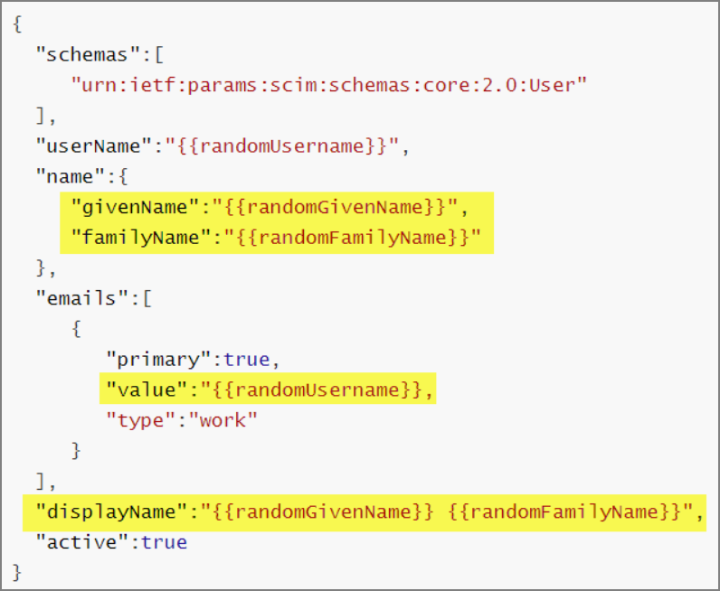
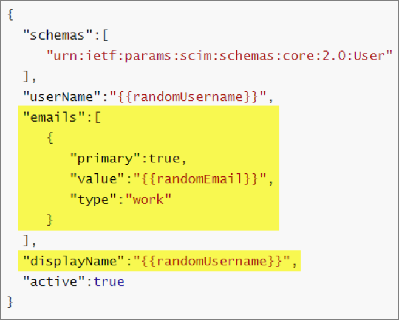

[title]: # (Okta SCIM Integration)
[tags]: # (okta)
[priority]: # (103)
# Okta SCIM Integration

## Introduction
This document explains how to connect Okta with the SCIM Connector application for Thycotic Secret Server (SS). This includes what Okta configuration settings are required for connection, known issues, and other related information.

## Configuring an Okta Endpoint to Work with the SCIM Connector

The steps in this section are required to configure Okta for use as a SCIM EndPoint for the SS SCIM Connector application. They are in addition to making a SCIM Endpoint connection within the SCIM Connector application itself.

By default, there are two fields in OKTA that are marked as mandatory and used to identify users; these are the __First Name__ and __Last Name__ fields (please see the Okta Universal Directory link below for details).

However, the Secret Server SCIM Connector application uses the primary email value to identify users instead, so if the SCIM connector uses the SCIM standard to request user values, it passes blank values for these two fields, resulting in data request or importation failure. To allow OKTA and the SCIM Connector to communicate successfully, you must change the status of these two fields (First Name and Last Name) from [mandatory to optional](https://support.okta.com/help/s/question/0D50Z00008G7VLL/can-we-make-firstname-and-lastname-as-optional-fields).

Once the fields are made optional, some additional changes are required in the code for the JSON body of the POST call (the yellow-highlighting shows the modified text):

Original JSON body for the POST call:

   

Modified JSON body for the POST call:

   

Please see the following links for further information regarding Okta Documentation:

   * [SCIM: Provisioning with Okta’s Lifecycle Management](https://developer.okta.com/docs/concepts/scim/)
   * [Okta Basic User Schema](https://developer.okta.com/docs/concepts/scim/#basic-user-schema)