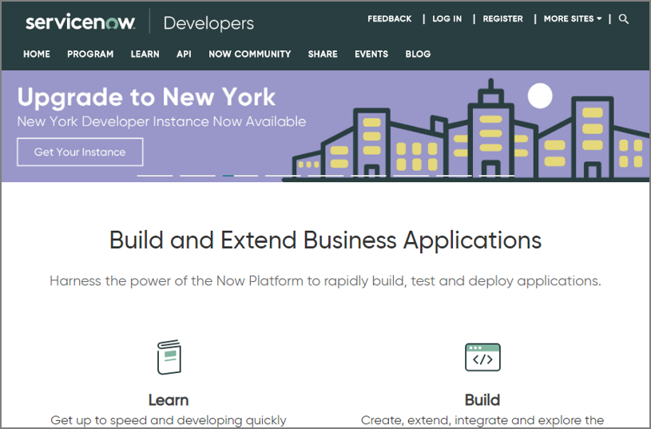
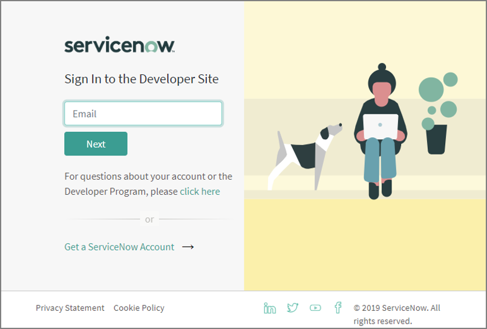
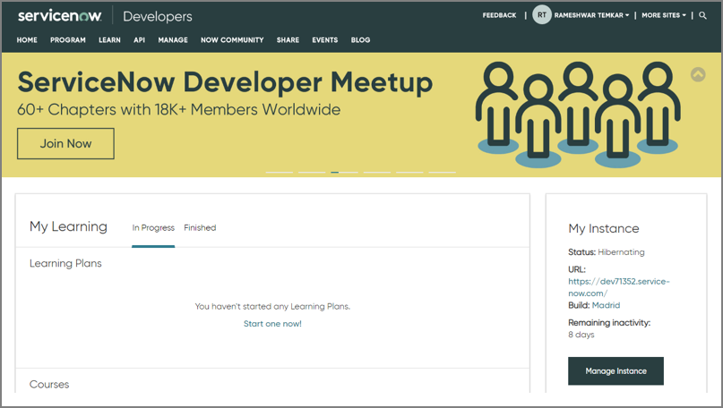
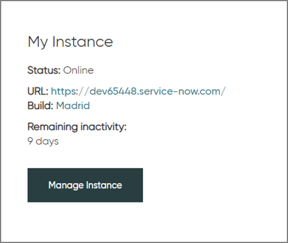
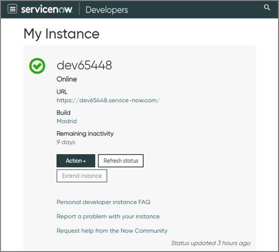

[title]: # (Installation)
[tags]: # (introduction)
[priority]: # (1)
[display]: # (none)
# Step One: Creating an Instance in ServiceNow

Create an instance in ServiceNow by accessing the Developer site.

__To create an instance in ServiceNow:__

1. In the browser, type https://developer.servicenow.com/ and press __Enter__. The __Developers__ page of the ServiceNow website appears.

   
1. On the upper-right, click __LOG IN__. The __Sign In to the Developer Site__ page appears.

   
1. In the __Email__ text box, type the email address and then click __Next__. The __Password__ text box appears.

   
1. In the __Password__ text box, type the password and then click __Sign in__. A dashboard appears with __My Learning__ and __My Instance sections__.

   
1. In the __My Instance__ section, click __Manage Instance__.

   
1. The created instance appears.

   
