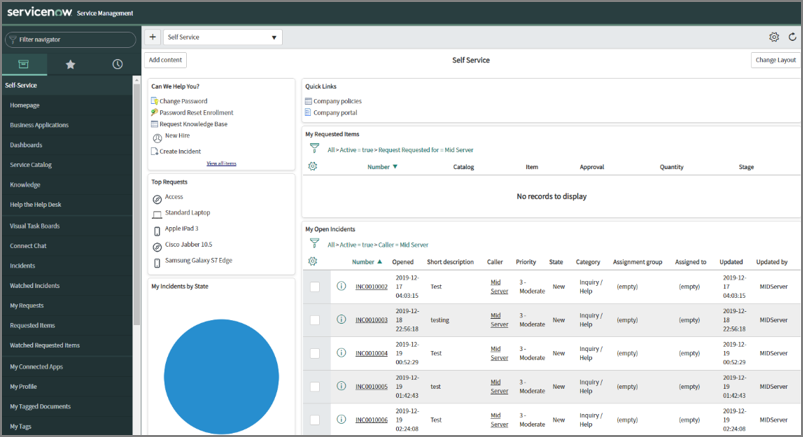
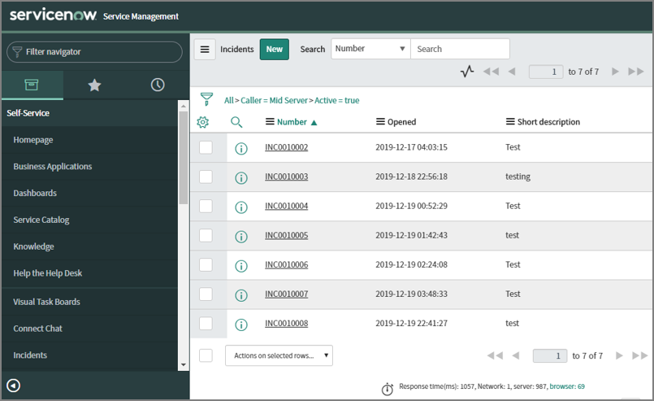

[title]: # (Creating an Incident in ServiceNow Instance)
[tags]: # (steps)
[priority]: # (202)
# Step Two: Creating an Incident in ServiceNow Instance

Create an incident in ServiceNow instance by accessing the Incidents menu.

__Create an incident in ServiceNow instance by accessing the Incidents menu.__

1. Create an incident in ServiceNow instance by accessing the Incidents menu.
1. In the browser type the __URL__ mentioned in the __My Instance__ section and press __Enter__. The login page of the __servicenow Service Management__ appears.

   
1. In the __User name__ text box, type the user name.
1. In the __Password__ text box, type the password.
1. Click __Login__. The Self __Service dashboard__ appears.

   
1. On the left side of the screen, click the __Incidents__ menu. The __Incidents__ page appears.

   
1. Click __New__. The __Create Incident__ page appears.

   
1. From the __Urgency__ list, select the type of urgency.

1. In the __More information__ text box, describe the issue.
1. Click __Submit__. The incidence is created.

   
