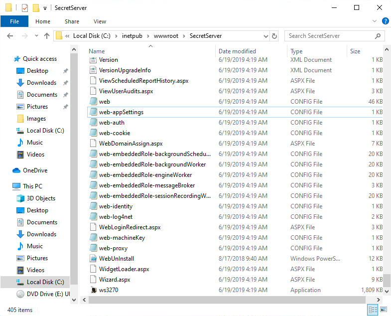
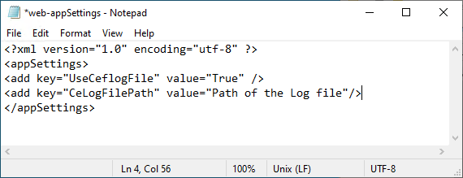

[title]: # (Adding keys to Secret Server Config file)
[tags]: # (introduction)
[priority]: # (104)
# Adding keys to Secret Server Config file

You will have to frist create a folder and file to save the Syslogs on the computer where
Secret Server is installed.

## To add keys to the Secret Server config file

1. On the computer where Secret Server is installed, create a folder and a file
    within the folder where you want to save the **Syslogs.**

1. On the computer where Secret Server is installed, go to __inetpub | wwwroot| SecretServer | web-appSettings.config__ file.  

    

1. Open the **web-appSettings.config** file in Notepad.

    
1. Add the keys as shown below.

    
