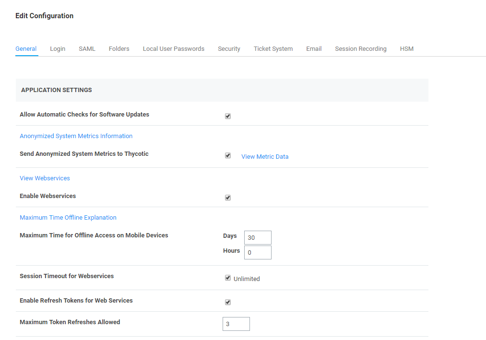
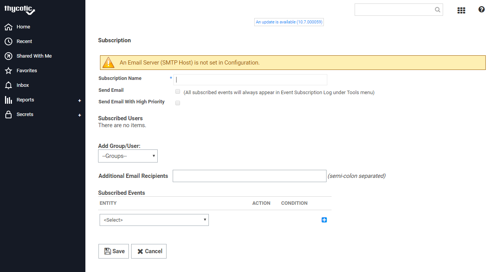
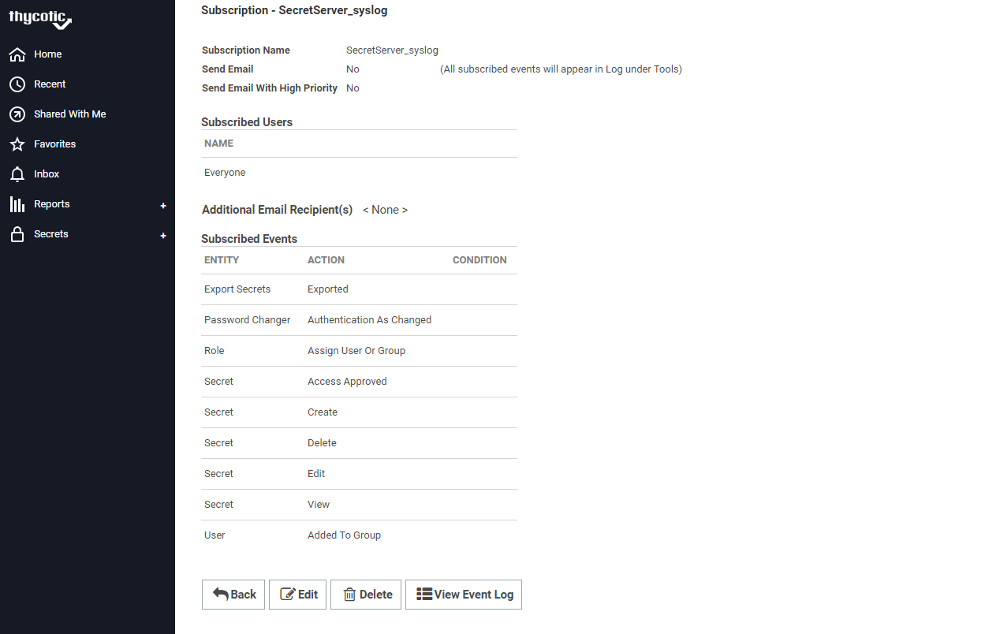
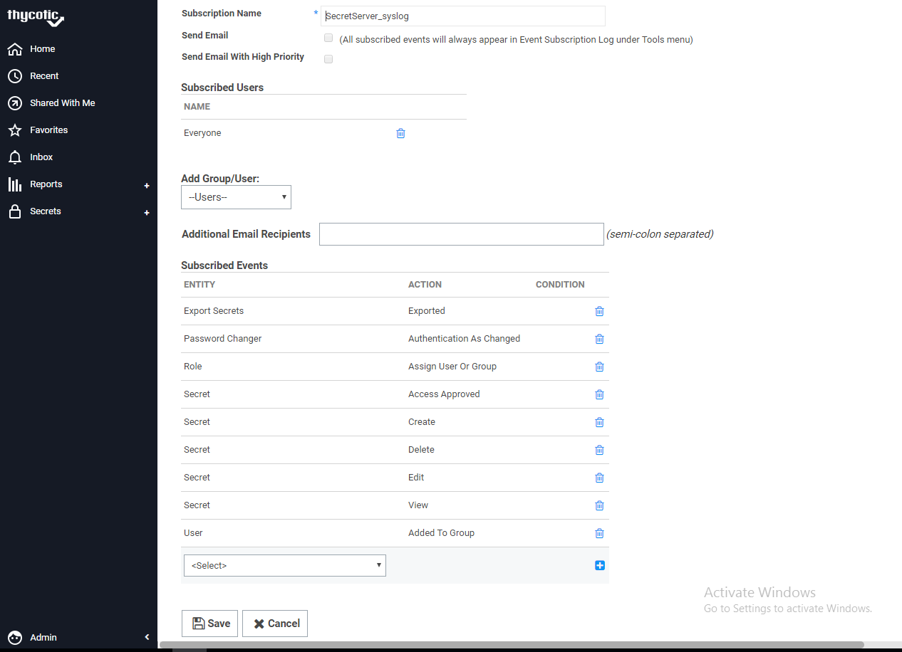

[title]: # (Configuring Secret Server settings)
[tags]: # (introduction)
[priority]: # (103)
# Configuring Secret Server settings

Configure Secret Server settings such as Enable Web Service, Enable Syslog, and
Add Event Subscription. This section provides the steps to configure Secret
Server settings, add an event, and modify an event.

## To configure Secret Server settings

1. Sign into __Secret Server__.

   
The __Home__ page appears.

   
1. Click __Admin | Configuration__.

    
1. At the bottom of the page, click __Edit__.  

    
1. The __Edit Configuration__ page appears.  

    
1. Select the __Enable Webservices__ settings check box.

1. Under the __Syslog/CEF Logging Advanced Settings Information__ area, select
    the __Enable Syslog/CEF Logging__ check box.
1. At the end of the page, click __Save__.  

    
1. Click __Admin | Event Subscriptions__.

    
1. The __Event Subscriptions__ page appears.

    

The Secret Server settings are configured.
You can add a new event subscription or modify the existing event.

## To add a new Event Subscription

1. In the __Event Subscription__ page, click __+New__. The __Subscription__
    page appears.

   

1. In the __Subscription Name__, type the name for the event subscription.
1. In the __Add Group/User__ list, select the group or the user.
1. In the __Subscribed Events__ list, select the events.
1. Modify the other fields as required.
1. Click __Save__.

## To modify an existing event

1. In the __Event Subscription__ page, click the event name. The __Subscription__ -__<name of the event>__ page appears.  

    
1. Click __Edit__.  

    
1. Modify the fields as required.

1. Click __Save__.  
An existing event is modified.
