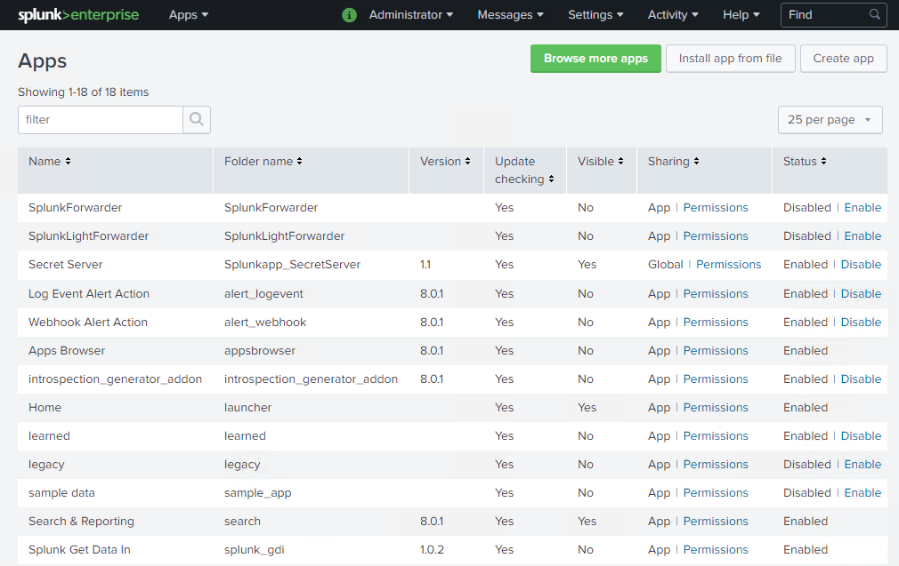
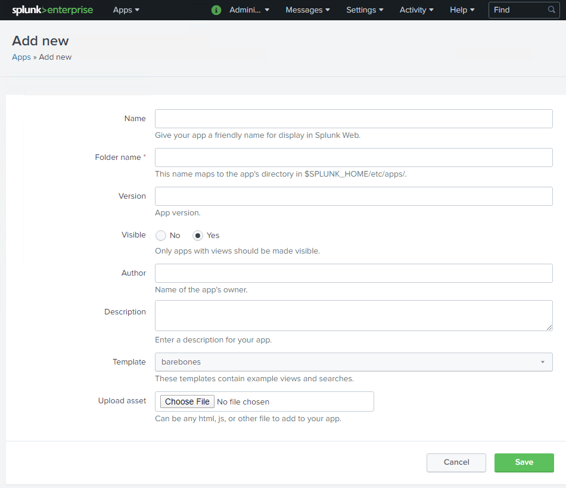
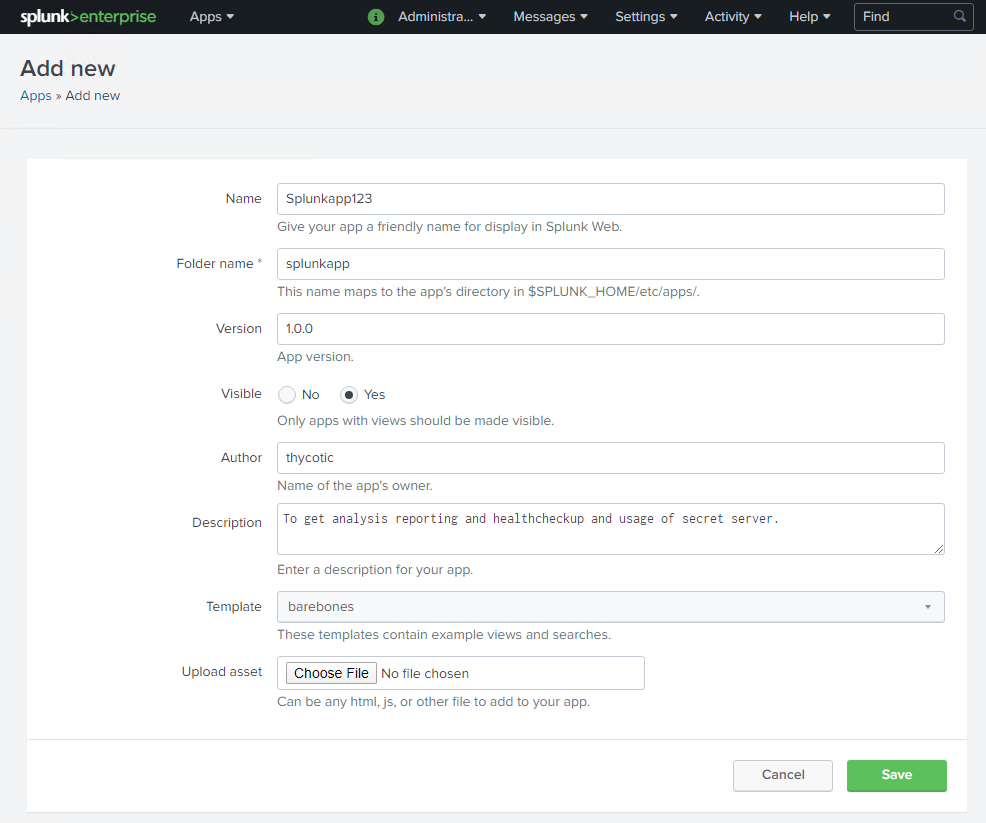
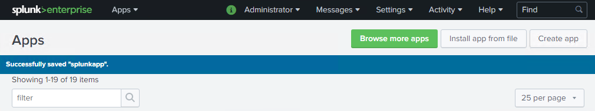

[title]: # (Create an App)
[tags]: # (introduction)
[priority]: # (106)
# Create an App

The first step is to fill in the information for the __Add new page__ to create an App.

## To create an App

1. Go to __Splunk Enterprise__.

   >**Note:** After installing Splunk enterprise edition, you can open an enterprise by entering the URL https://localhost:8000.

   

1. On the left-hand side, click the __Manage Apps__ icon. The __Apps__ page appears.

   
   

1. On the upper-right click __Create app__. The __Add new__ page appears.

   
1. In the __Add new__ page, fill in the information:

   
1. Select the default template.

1. Click __Save__. On the upper-left, a message, __Successfully saved
    “splunkapp”.__ appears.

   

1. The Splunk app is saved.

You can check the new app at the following location on your computer where
enterprise edition is installed: `C:\\Program Files\\Splunk\\etc\\apps`.
