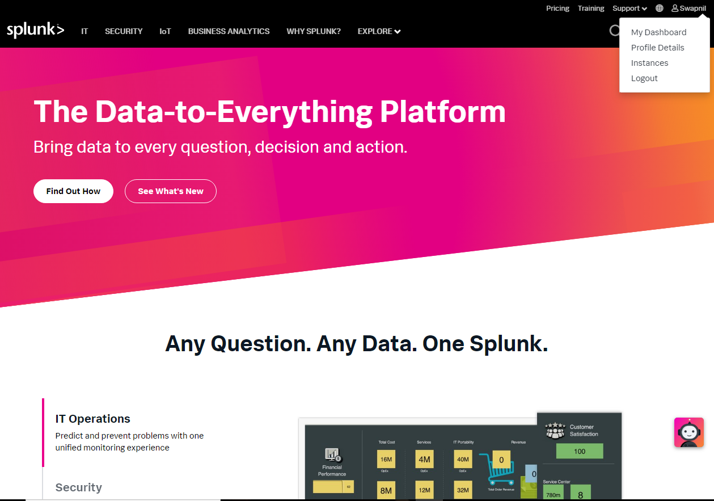
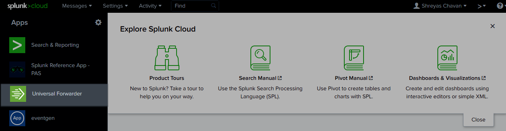

[title]: # (Installing and configuring Universal Forwarder)
[tags]: # (introduction)
[priority]: # (102)
# Installing and configuring Universal Forwarder

Install and configure Universal Forwarder on the server machine where Secret
Server is installed. The Universal Forwarder sends data to the Splunk platform.

**To install and configure Universal Forwarder:**

1.  On the upper-right of the Splunk website, click **Username** \> **Login**.
    The **Log In** window appears.  
    

    

2.  In the **Username**, type the username.

3.  In the **Password**, type the password.

4.  Click **Log In**. You are logged into Splunk.  
    

    

5.  On the upper-right click **Username** \> **Instances**. The **Explore Splunk
    Cloud** window appears.  
    

    

6.  On the left-hand side, click **Universal Forwarder**. The **Universal
    Forwarder** window appears.

    

7.  Follow Steps 1 to 5 as mentioned on the screen above.

**Note:** In Step 1, choose an appropriate **Installation Package.**