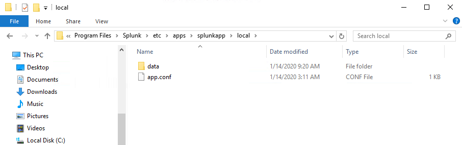
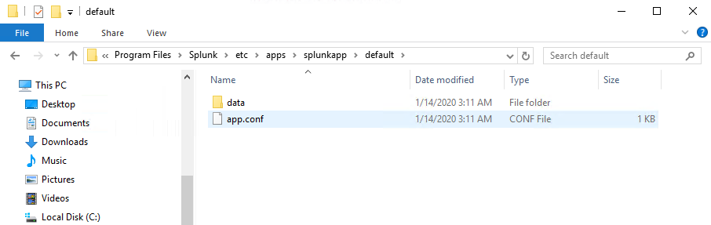
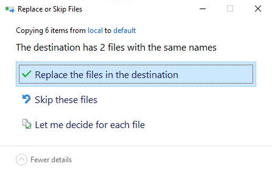
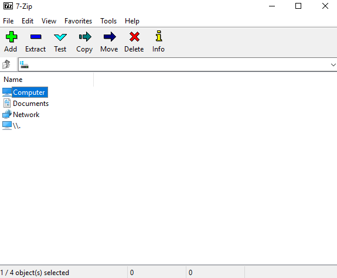
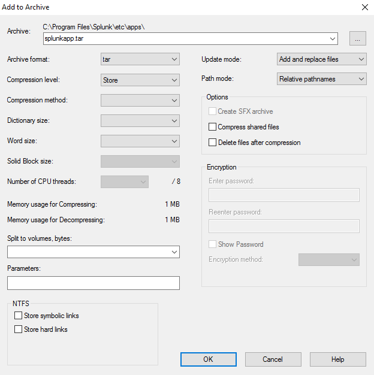
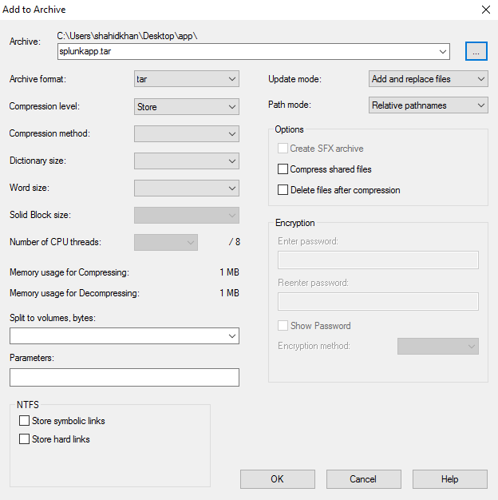
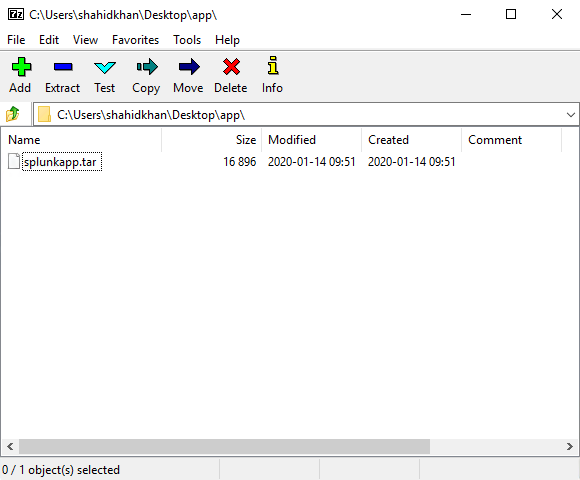
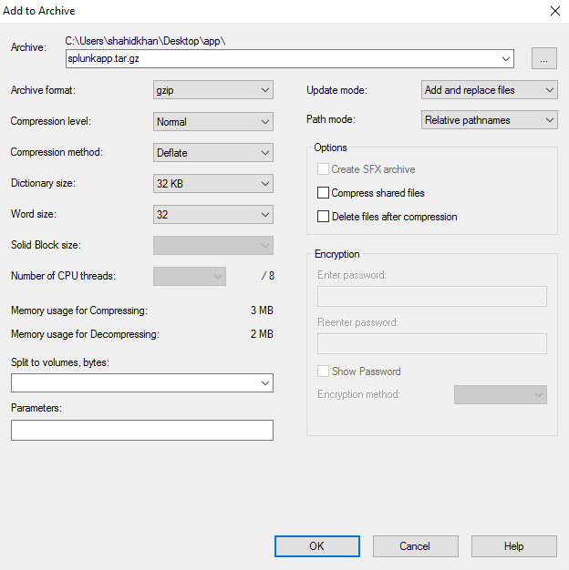

[title]: # (Package the App)
[tags]: # (introduction)
[priority]: # (106)
# Package the App

Packaging is the final step before uploading your app to Splunkbase. For this,
you take your App directory and compress it into a single file that can be
uploaded to Splunkbase.

Splunkbase uploads are required to have the .spl file extension. For
example: myapp.spl. SPL format is identical
to [.tar.gz](http://en.wikipedia.org/wiki/Tar_(file_format)) format. The only
difference is the file extension.

Make sure you have placed all the app components in the correct location, have
moved all customizations from `\\local to \\default`, and have tested your app
before you package it.

## Additional Information for Splunk App and Secret Server

### Packaging your app for Splunkbase

The final step before uploading your app to Splunkbase is packaging. This means taking your app's directory and turning it into a single compressed file which can be uploaded to Splunkbase. Splunkbase uploads are required to have the .spl file extension, e.g. myapp.spl. SPL format is identical to .tar.gz format. The only difference is the file extension. Make sure you have placed all the app components in the correct location, have moved all customizations from /local to /default, and have tested your app before you package it.

## To move all customizations from \\local” to “\\default

1. Go to `C:\\Program Files\\Splunk\\etc\\apps\\splunkapp\\local`.

   

1. Copy the data folder.

1. Go to C:\\Program Files\\Splunk\\etc\\apps\\splunkapp\\default.

   

1. Paste the data folder. The __Replace or Skip Files__ dialog box appears.

   

1. Click __Replace the file in the destination__.

## To package the app to TAR using 7-Zip

1. Install __7-Zip__ from <http://www.7-zip.org/>.

1. Open __7-Zip__.

   
1. On 7-Zip file explorer, navigate to the parent directory of your app (for
    example: `c:\\Program Files\\Splunk\\etc\\apps`.

   
1. Click the __Add__ icon. The __Add to Archive__ dialog box appears.

   

   
1. Select the __Archive format__ as tar.

1. Click the ellipsis icon to choose the location where you want to save the TAR file.

   

   
1. Click __Open__.

   
1. Click __OK__.

## To package the app to GZIP using 7-Zip

1. Open __7-Zip__.

1. On 7-Zip file explorer, navigate to the location where you have saved the
    TAR file.

   
1. Select the file.

1. Select the __Archive format__ as gzip.
   

1. Click __OK__.

The App is packaged, and you can upload the App to your Splunkbase.
