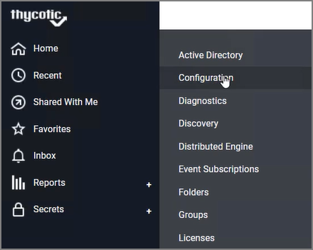
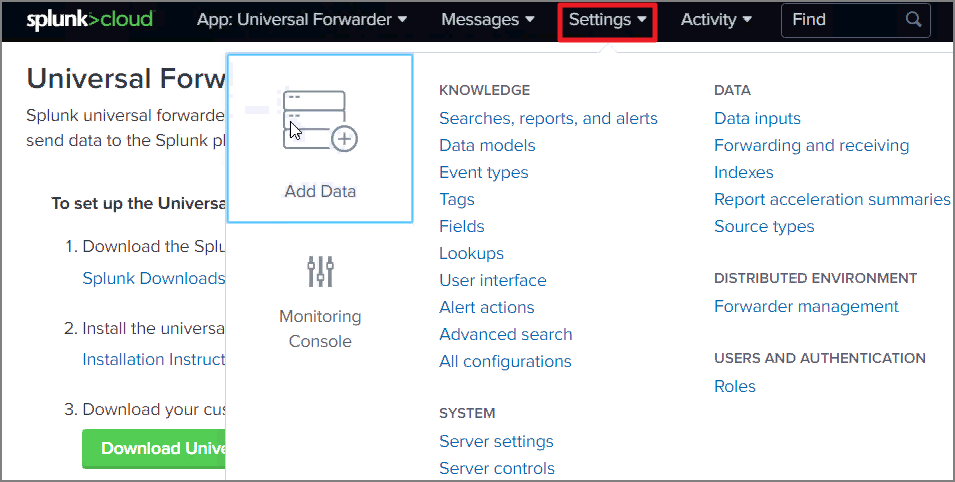
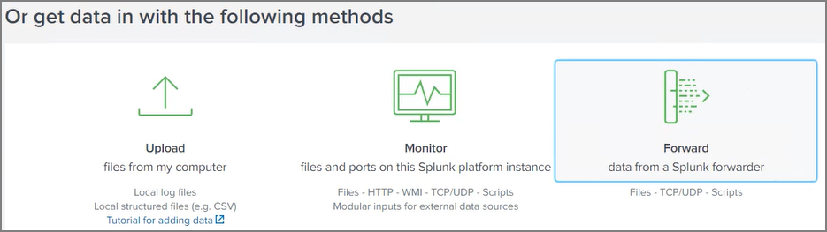
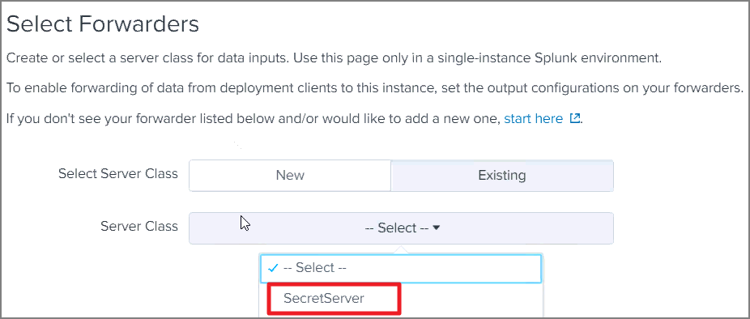
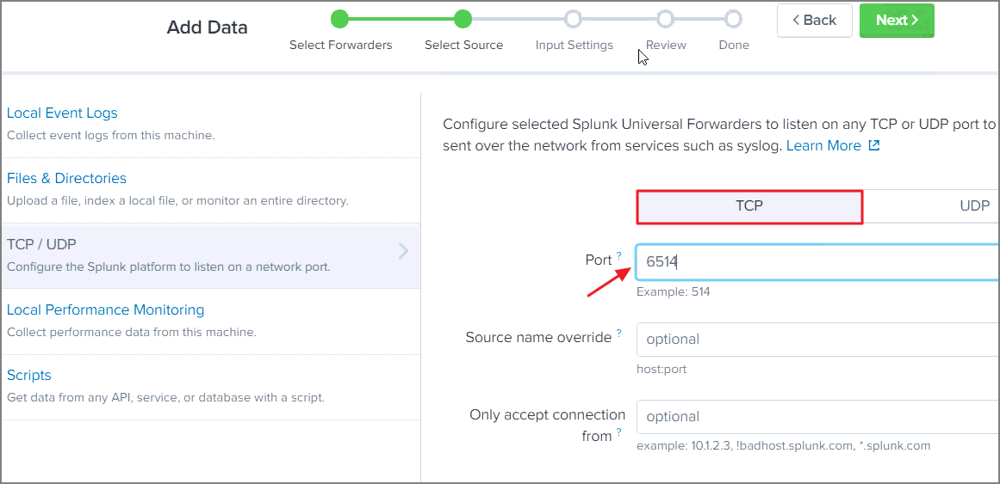
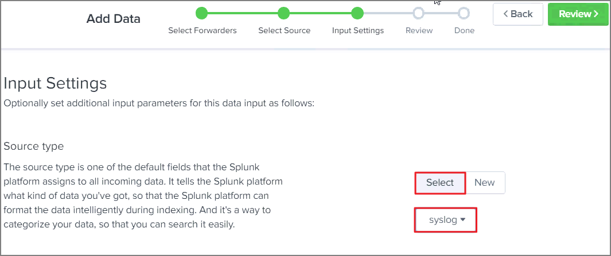
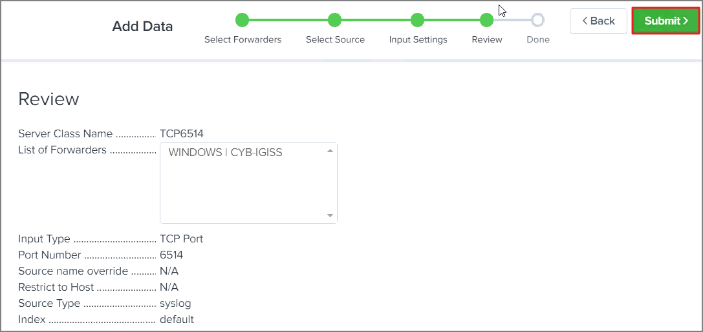

[title]: # (Configuration for TCP)
[tags]: # (tcp)
[priority]: # (103)
# Configuration for TCP

1. Navigate to __Secret Server__.
1. Go to __Admin | Configuration__.

   
1. Click on __Syslog/CEF logging Advanced Settings Information__.
1. Edit the following settings:

   * __Enable Syslog/CEF Logging__: Yes
   * __Syslog/CEF Server__: IP address for the server
   * __Syslog/CEF Port__: Port number
   * __Syslog/CEF Protocol__: TCP

   
1. Click __Save__.
1. Navigate to __Splunk Cloud__.
1. Click on __Settings__.
1. Click on __Add Data__.

   
1. Click on __Forward__.

   
1. You can create a __New Server Class__ or select a previously created one.

   
1. Click on the option for __TCP/UDP__.

   
1. Click on __TCP__.
1. Enter the __port number__ for the server.

   
1. Click __Next__.
1. Click on __Source Type__.
1. Enter __`syslog`__.

   
1. Click on __Review__.
1. Review your settings and click __Submit__.

   
1. You can then click __Start Searching__ after the connection was successfully created.

   

   __Example of syslog output__:

   