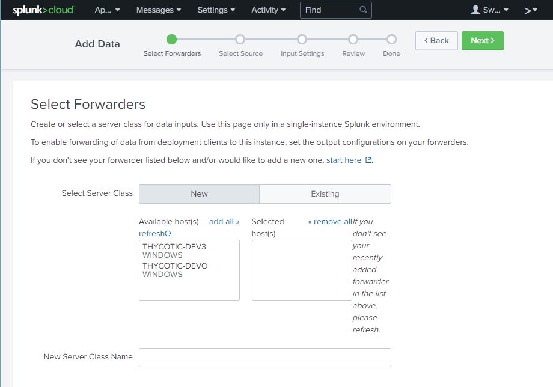
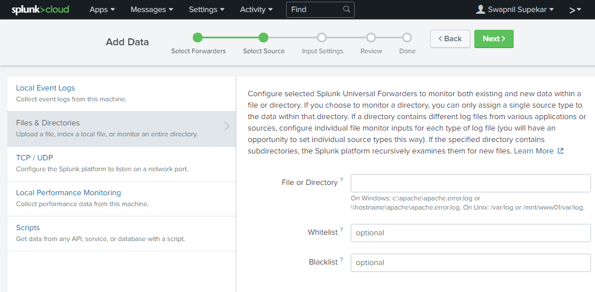
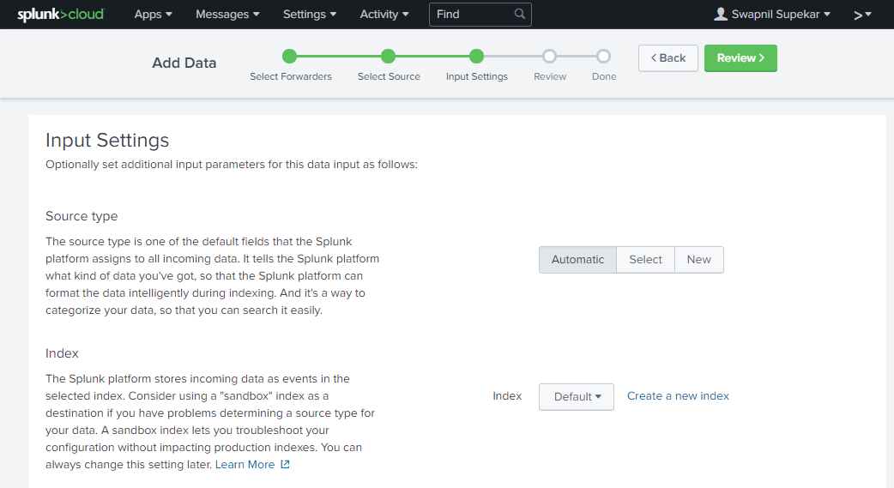
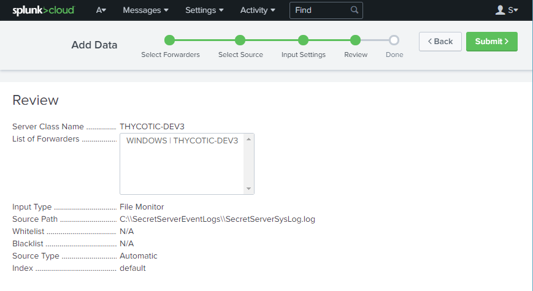
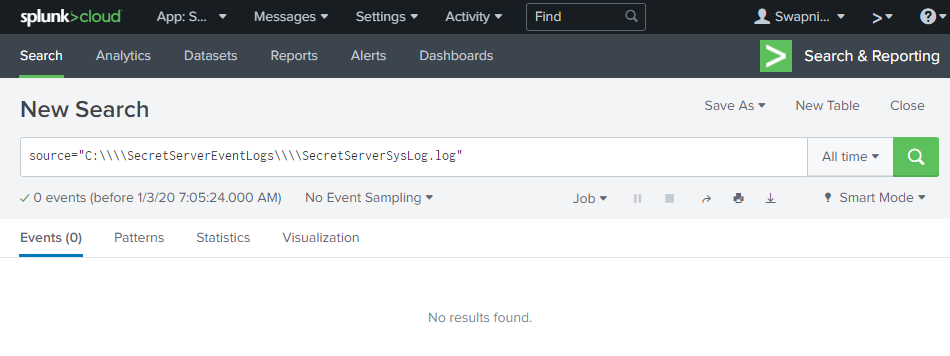
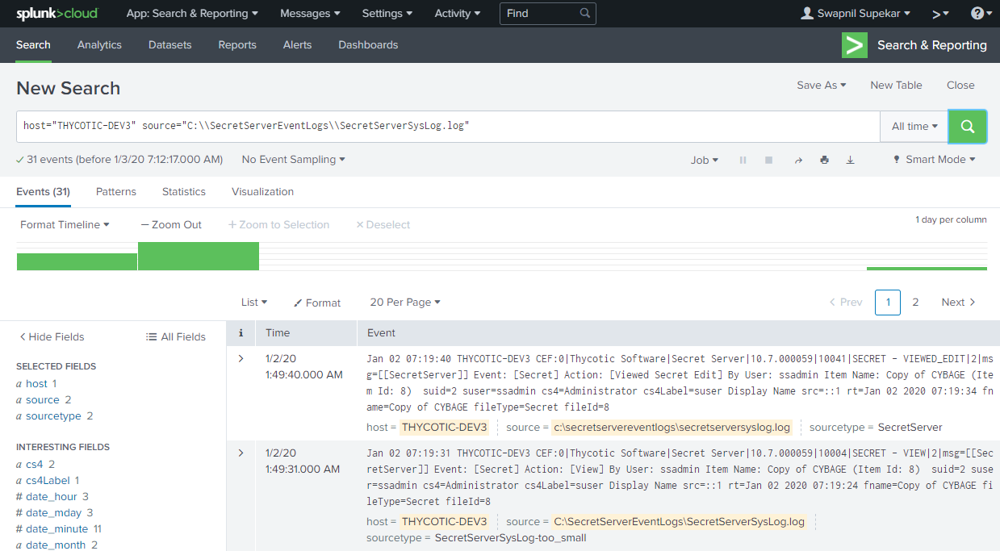

[title]: # (Viewing logs in Splunk Cloud)
[tags]: # (introduction)
[priority]: # (105)
# Viewing logs in Splunk Cloud

To view logs in the Splunk cloud, you must first clear the Secret Server
Application Pool and then add data. After adding data, you must search for the
logs using a query.

## To clear and add data

1. Type IIS in the __Search__ box. The __Internet Information Services (IIS)
    Manager app__ is populated.

    
1. Click the __Internet Information Services (IIS) Manager__ app. The
    __Internet Information Services (IIS) Manager__ dialog box appears.

1. Go to __Connections | Application Pools | Secret Server__.

   
1. Right-click __SecretServer__ and click __Recycle__.

1. .  Go to __Splunk Cloud Instance | Settings | Add Data__ |
    __Forward__. The __Select Forwarders__ page appears.

   
1. In the __Available host(s)__ text box, the computer on which the Universal
    Forwarder instance is installed is displayed.

1. Click __Existing | Select | Select the name of the Server Class__.

   

   >**Note:** To select a new server class, click __New__ and add a new __Server Class__.

The Universal Forwarder is selected. This Universal Forwarder sends data to the
Splunk platform.

   

1. Click __Next__. The __Select Source__ page appears.

   
1. On the left-hand side, click __Files & Directories__.

   
1. In the __File or Directory__ text box, type the path of the syslog file that
    is created in [Step 1](#Adding_Keys_Step_01).
1. Click __Next__. The __Input Settings__ page appears.

    
1. Click __Source type__ as __Automatic__

1. In the __Index__ list, select __Default__.

1. Click __Review__. The __Review__ page appears.

    
1. In the __Review__ page, review the information.
1. Click __Submit__. The message “__File input has been created successfully.__” appears.

    
1. Click __Start Searching__. The __New Search__ page appears.

    
1. In the __New Search__ text box, type the query and click Search icon.

    

   >**Note:** For more information on search, see the following link: <https://docs.splunk.com/Documentation/Splunk/latest/SearchReference/Search>

   

   The Syslogs from the secret server appears along with the details.

   

   The logs can be successfully viewed in the Splunk Cloud.
