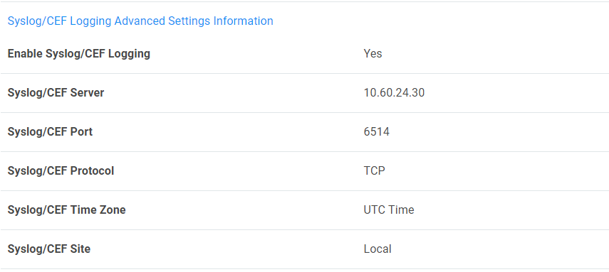
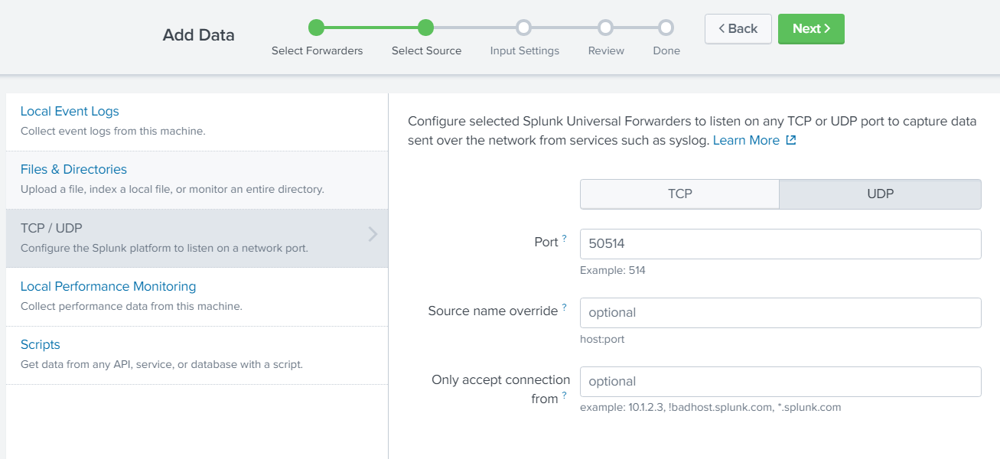
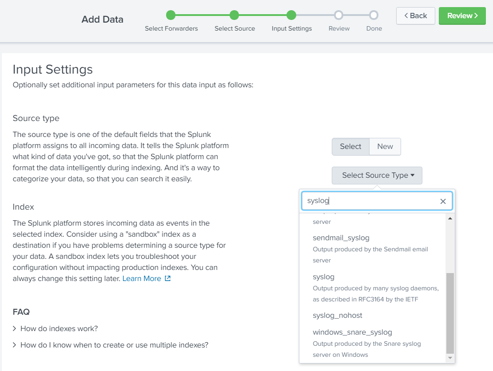

[title]: # (Configuring Secret Server settings)
[tags]: # (universal forwarder )
[priority]: # (105)
# Configuring Secret Server settings

## To configure Secret Server Settings:

1. Sign into __Secret Server__.

   
1. The __Home__ page appears.

   
1. Click __Admin__ | __Configuration__. The __Configuration__ page appears.

   
1. At the bottom of the page, click __Edit__.  

   
1. The __Edit Configuration__ page appears.  

   
1. Select the __Enable Webservices__ settings check box.

1. Under the __Syslog/CEF Logging Advanced Settings Information__ area, select the __Enable Syslog/CEF Logging__ check box and enter the __syslog server__

   >**Note:** This should be the ip of machine/server where splunk enterprise is configured).

   

1. At the end of the page, click __Save__.  

   

## Configuration in Splunk Enterprise

1. Go to __Splunk enterprise__ | __Settings__ | __Add Data__ | Click on __Monitor__.

1. The __Select Source__ page appears. On the left-hand side, click __TCP/UDP.__

1. On right hand side, select UDP/TCP and enter the port which we have configured in Secret Server, Example: __TCP 6514__.  

   
1. Click __Next__. On __Input Settings__ page select source type as syslog.  

   
1. In the __Index__ list, select __Default__.
1. Click __Review__. The __Review__ page appears, review the information.
1. Click __Submit__. The message “__File input has been created successfully.__” Appears

   
1. Click __Start Searching__. The __New Search__ page appears.
1. In the __New Search__ text box, type the query and click __Search icon__.

   
