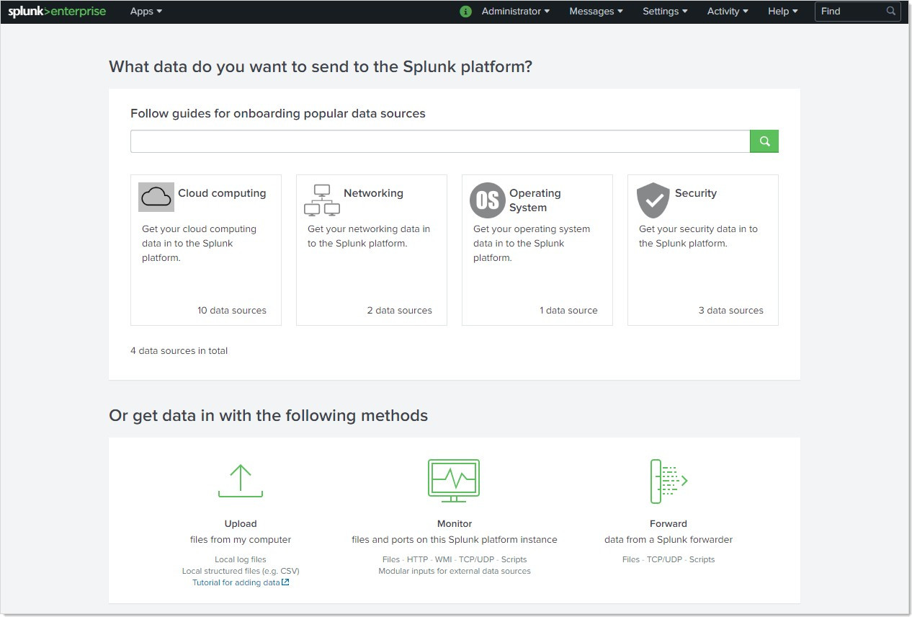
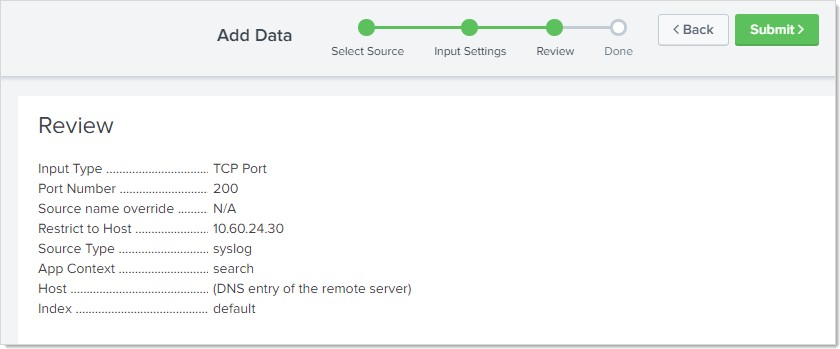

[title]: # (Configuring Splunk)
[tags]: # (configuration)
[priority]: # (102)
# Configuring Splunk

1. Go to Splunk at https://login.splunk.com.

1. Click the user icon at the top right and select **Sign Up**.

1. Complete the **Create Your Splunk Account** page.

1. Click the **Create Your Account** button.

1. Download the [Splunk Enterprise
    setup](https://www.splunk.com/en_us/download/splunk-enterprise.html).

1. Install Splunk Enterprise.

1. Log into your Splunk Enterprise at
    [http://localhost:8000/](http://localhost:8000/en-US/account/login).

   >**Note:** The first time you log in, use the default username "admin" and the password you set during installation. You can then change the password and log in again with your new password.

1. On the Splunk console home page, click the **Add Data** button. The Add Data
    page appears:

   
1. Click the **Monitor** button at the bottom of the page. The unlabeled Select
    Source page appears:

   
1. Click the **TCP/UDP** menu item on the left. Data entry controls appear:

   
1.  Click the **TCP** button.

1. Type `200` in the **Port** text box. This port must match the port
    configured in SS for the syslog.

1. Type the IP address of your SS machine in the **Only accept connection
    from** text box.

1. Click the **Next \>** button. The Input Settings page appears:

   
1. Click the **Select Source Type** dropdown list and select **Operating System
    \> syslog**.

1. Click the **Review \>** button. A review listing appears:

   
1. Confirm the settings you chose.

1. Click the **Submit** button.